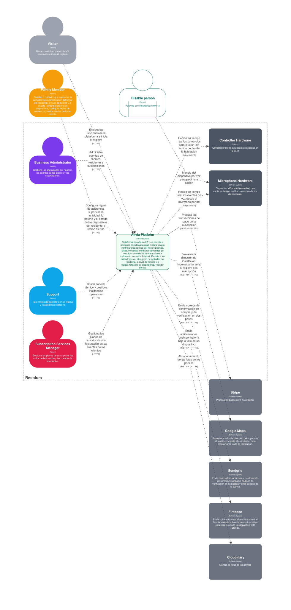

# Capítulo 4: Strategic-Level Software Design

## 4.1. Strategic-Level Attribute-Driven Design (ADD)

### 4.1.1. Design Purpose

El propósito de este diseño es establecer una arquitectura que integre dos componentes complementarios. El primero, basado en IoT y Edge Computing, permite a la persona con discapacidad motora realizar de forma autónoma acciones cotidianas del hogar, tales como abrir puertas y ventanas o encender luces, mediante comandos de voz interpretados localmente por un modelo de aprendizaje automático, garantizando respuesta inmediata incluso sin conexión a Internet. El segundo componente sincroniza esta información en la nube y gestiona el cuidado de la persona asistida (horarios, medicamentos y tareas), habilitando que el cuidador reciba alertas, supervise remotamente el estado del hogar y coordine la atención. La arquitectura debe conectar ambos componentes mediante un flujo de eventos: las acciones y solicitudes generadas en el borde alimentan la capa de supervisión y comunicación en la nube, sin que la autonomía inmediata dependa de esa sincronización.

### 4.1.2. Attribute-Driven Design Inputs

Esta sección presenta las funcionalidades principales y los escenarios de calidad que orientan las decisiones arquitectónicas de Alivia.

#### 4.1.2.1. Primary Functionality (Primary User Stories)

Se seleccionaron las épicas e historias de usuario que representan las funcionalidades esenciales de Alivia y que generan mayor impacto en su arquitectura. Estas se relacionan principalmente con el control por voz, la operación sin Internet, la supervisión remota, la gestión de alertas, la coordinación del cuidado y el monitoreo de dispositivos, considerando los atributos prioritarios de confiabilidad, usabilidad, performance, disponibilidad y observabilidad.

| Epic / User Story ID | Título                                                  | Descripción                                                                                                                                                                                                                                                                                                            | Criterios de Aceptación                                                                                                                                                                                                                                                                                                                                                                                                                                                                                                                                                                                                                                                                      | Relacionado con (Epic ID) |
|----------------------|---------------------------------------------------------|------------------------------------------------------------------------------------------------------------------------------------------------------------------------------------------------------------------------------------------------------------------------------------------------------------------------|----------------------------------------------------------------------------------------------------------------------------------------------------------------------------------------------------------------------------------------------------------------------------------------------------------------------------------------------------------------------------------------------------------------------------------------------------------------------------------------------------------------------------------------------------------------------------------------------------------------------------------------------------------------------------------------------|---------------------------|
| **EP03**             | **Evaluación, instalación y activación del servicio**   | Gestiona la evaluación presencial, asignación del técnico, adaptación del plan, confirmación del cobro, instalación, pruebas y conformidad del cliente.                                                                                                                                                                | —                                                                                                                                                                                                                                                                                                                                                                                                                                                                                                                                                                                                                                                                                            | —                         |
| US11                 | Instalar y comprobar el servicio                        | **Como** técnico o instalador, **quiero** instalar, configurar y comprobar los dispositivos incluidos, **para** entregar el servicio funcionando correctamente.                                                                                                                                                  | **Escenario #1: Instalación satisfactoria** Dado que la vivienda fue aprobada y el pago está confirmado, cuando instala y prueba los dispositivos, entonces registra resultados satisfactorios para luz, puerta, ventana y dispositivo de interacción por voz.  **Escenario #2: Falla durante la instalación** Dado que un dispositivo no supera las pruebas, cuando registra la falla, entonces la instalación permanece pendiente y se coordina la corrección o reemplazo.  **Escenario #3: Activación con conformidad** Dado que todas las pruebas fueron satisfactorias, cuando el cliente confirma la recepción, entonces se activa la suscripción y las funciones instaladas. | EP03                      |
| **EP06**             | **Control autónomo y accesible del entorno doméstico**  | Permite que la persona asistida controle luces, puertas y ventanas mediante comandos de voz, reciba confirmaciones comprensibles y mantenga las acciones esenciales ante una interrupción de conexión.                                                                                                                 | —                                                                                                                                                                                                                                                                                                                                                                                                                                                                                                                                                                                                                                                                                            | —                         |
| US18                 | Controlar la iluminación mediante voz                   | **Como** persona con discapacidad motora severa, **quiero** encender y apagar la luz mediante mi voz, **para** controlar la iluminación sin depender de otra persona.                                                                                                                                            | **Escenario #1: Encendido exitoso** Dado que la luz está disponible, cuando solicita encenderla, entonces la luz se enciende y se confirma el resultado de forma audible.  **Escenario #2: Apagado exitoso** Dado que la luz está encendida, cuando solicita apagarla, entonces la luz se apaga y se confirma el resultado.  **Escenario #3: Luz sin respuesta** Dado que la luz no responde, cuando intenta controlarla, entonces se informa la falla, no se afectan otros dispositivos y se avisa al cuidador.                                                                                                                                      | EP06                      |
| US19                 | Controlar la puerta mediante voz                        | **Como** persona con discapacidad motora severa, **quiero** abrir o cerrar la puerta mediante mi voz, **para** ingresar, salir o recibir ayuda con mayor autonomía.                                                                                                                                              | **Escenario #1: Apertura exitosa** Dado que la puerta está disponible, cuando solicita abrirla, entonces la puerta se acciona y se confirma el resultado.  **Escenario #2: Cierre exitoso** Dado que la puerta puede cerrarse, cuando solicita su cierre, entonces la puerta se acciona y se confirma el resultado.  **Escenario #3: Puerta atascada** Dado que la puerta presenta un bloqueo, cuando intenta accionarla, entonces se informa la falla, se mantiene la condición segura y se alerta al cuidador.                                                                                                                                      | EP06                      |
| US20                 | Controlar la ventana mediante voz                       | **Como** persona con discapacidad motora severa, **quiero** abrir o cerrar la ventana mediante mi voz, **para** ventilar o proteger la habitación sin asistencia directa.                                                                                                                                        | **Escenario #1: Apertura exitosa** Dado que la ventana está disponible, cuando solicita abrirla, entonces la ventana se acciona y se confirma el resultado.  **Escenario #2: Cierre exitoso** Dado que la ventana puede cerrarse, cuando solicita su cierre, entonces la ventana se acciona y se confirma el resultado.  **Escenario #3: Ventana bloqueada** Dado que presenta resistencia o no informa su estado, cuando intenta accionarla, entonces se detiene la acción, se informa la falla y se alerta al cuidador.                                                                                                                             | EP06                      |
| US21                 | Mantener el control esencial sin Internet               | **Como** persona con discapacidad motora severa, **quiero** continuar controlando los dispositivos esenciales cuando se pierda Internet, **para** no quedar sin autonomía por un problema de conexión.                                                                                                           | **Escenario #1: Control local disponible** Dado que no existe conexión externa, cuando solicita controlar un dispositivo disponible, entonces la acción se procesa localmente y se confirma el resultado.  **Escenario #2: Conservación de eventos** Dado que se realizan acciones durante la interrupción, cuando todavía no existe conexión, entonces los eventos quedan pendientes sin impedir el control local.  **Escenario #3: Restablecimiento de conexión** Dado que existen eventos pendientes, cuando se recupera la conexión, entonces se incorporan al historial sin duplicarlos.                                                         | EP06                      |
| **EP07**             | **Supervisión remota, alertas y solicitud de auxilio**  | Permite que el cuidador conozca estados relevantes, reciba alertas escritas y discretas, confirme su atención y sea informado ante solicitudes de auxilio o condiciones críticas.                                                                                                                                      | —                                                                                                                                                                                                                                                                                                                                                                                                                                                                                                                                                                                                                                                                                            | —                         |
| US22                 | Supervisar remotamente a la persona asistida            | **Como** familiar o cuidador, **quiero** consultar el estado de los dispositivos y los eventos recientes, **para** conocer situaciones relevantes cuando estoy fuera del hogar.                                                                                                                                  | **Escenario #1: Consulta de estado** Dado que está autorizado, cuando consulta a la persona asistida, entonces conoce el último estado disponible de los dispositivos.  **Escenario #2: Consulta del historial** Dado que existen acciones y alertas, cuando consulta los eventos recientes, entonces conoce qué ocurrió, cuándo y qué dispositivo estuvo involucrado.  **Escenario #3: Información desactualizada** Dado que la vivienda perdió la conexión, cuando consulta el estado, entonces se informa la última actualización y que pueden existir eventos pendientes.                                                                         | EP07                      |
| US23                 | Recibir alertas escritas de rápida lectura              | **Como** familiar o cuidador, **quiero** recibir alertas escritas que identifiquen la necesidad y su prioridad, **para** comprender rápidamente lo ocurrido incluso cuando no puedo escuchar audio.                                                                                                              | **Escenario #1: Alerta completa** Dado que se detecta una situación que requiere atención, cuando se genera la alerta, entonces recibe la persona relacionada, necesidad, prioridad y momento.  **Escenario #2: Alerta crítica** Dado que la situación es crítica, cuando se genera la alerta, entonces se diferencia su prioridad y se solicita confirmación.  **Escenario #3: Entrega pendiente** Dado que el cuidador no tiene conexión, cuando se intenta entregar la alerta, entonces permanece pendiente y se entrega cuando vuelve a estar disponible.                                                                                         | EP07                      |
| US24                 | Confirmar y atender alertas críticas                    | **Como** familiar o cuidador, **quiero** confirmar que recibí una alerta crítica, **para** detener las repeticiones y dejar constancia de su atención.                                                                                                                                                           | **Escenario #1: Confirmación oportuna** Dado que recibió una alerta crítica, cuando confirma su recepción, entonces se detienen las repeticiones y se registra quién la confirmó.  **Escenario #2: Repetición sin confirmación** Dado que la alerta continúa sin confirmación, cuando transcurren dos minutos, entonces se repite hasta alcanzar un máximo de tres avisos.  **Escenario #3: Pendiente crítica** Dado que concluyeron tres avisos sin confirmación, cuando transcurren seis minutos desde el primer aviso, entonces queda pendiente crítica y se incorpora al historial.                                                               | EP07                      |
| US25                 | Solicitar auxilio mediante voz                          | **Como** persona con discapacidad motora severa, **quiero** solicitar ayuda mediante una expresión de voz, **para** avisar rápidamente al cuidador cuando necesite asistencia.                                                                                                                                   | **Escenario #1: Solicitud reconocida** Dado que el dispositivo de interacción por voz está disponible, cuando pronuncia una expresión de auxilio reconocida, entonces se genera una alerta crítica y se confirma el envío.  **Escenario #2: Cuidador confirma** Dado que el cuidador recibió la alerta, cuando confirma su recepción, entonces la solicitud queda reconocida y la persona recibe una confirmación.  **Escenario #3: Solicitud sin confirmación** Dado que ningún cuidador confirma la alerta, cuando concluye el ciclo de avisos, entonces permanece pendiente crítica sin garantizar ayuda presencial.                                                             | EP07                      |
| **EP08**             | **Coordinación y continuidad del cuidado**              | Permite organizar turnos, disponibilidad, transferencia de responsabilidad y rutinas relacionadas con alimentación, higiene y movilización. También permite coordinar la administración de medicamentos mediante horarios, recordatorios, asignación del cuidador responsable y confirmación de la atención realizada. | —                                                                                                                                                                                                                                                                                                                                                                                                                                                                                                                                                                                                                                                                                            | —                         |
| US26                 | Organizar turnos y disponibilidad                       | **Como** familiar o cuidador, **quiero** registrar turnos y periodos de disponibilidad, **para** saber quién tiene la responsabilidad principal en cada momento.                                                                                                                                                 | **Escenario #1: Turno registrado** Dado que existe una red de cuidado, cuando asigna un cuidador a un periodo, entonces queda identificado como responsable del turno.  **Escenario #2: Consulta de disponibilidad** Dado que existen turnos programados, cuando consulta un periodo, entonces conoce quién está disponible y quién está a cargo.  **Escenario #3: Superposición de turnos** Dado que un cuidador ya tiene una responsabilidad coincidente, cuando intenta asignar otro turno incompatible, entonces se informa la coincidencia antes de confirmar.                                                                                   | EP08                      |
| US28                 | Coordinar rutinas de cuidado                            | **Como** familiar o cuidador, **quiero** programar y registrar rutinas de alimentación, higiene y movilización, **para** reducir omisiones y coordinar las actividades cotidianas.                                                                                                                               | **Escenario #1: Rutina programada** Dado que existe una persona asistida, cuando registra una actividad y horario, entonces la rutina queda disponible para los responsables.  **Escenario #2: Rutina completada** Dado que existe una actividad pendiente, cuando registra su atención, entonces quedan identificados la actividad, responsable y momento.  **Escenario #3: Rutina vencida** Dado que la actividad no fue confirmada, cuando vence su horario, entonces permanece identificada como pendiente.                                                                                                                                       | EP08                      |
| US29                 | Coordinar la administración de medicamentos             | **Como** familiar o cuidador, **quiero** registrar horarios y responsables de los medicamentos indicados, **para** coordinar su administración sin modificar las indicaciones establecidas.                                                                                                                      | **Escenario #1: Medicamento programado** Dado que cuenta con una indicación previamente establecida, cuando registra medicamento, horario y responsable, entonces se programa el recordatorio correspondiente.  **Escenario #2: Administración confirmada** Dado que existe una administración programada, cuando confirma que fue atendida, entonces se registra quién la atendió y en qué momento.  **Escenario #3: Administración pendiente** Dado que transcurre el horario sin confirmación, cuando se cumple el periodo establecido, entonces queda pendiente sin recomendar cambios de dosis ni tratamiento.                                   | EP08                      |
| **EP09**             | **Supervisión y mantenimiento de dispositivos**         | Permite conocer la conexión, batería y funcionamiento de los dispositivos, registrar fallas, solicitar soporte y gestionar mantenimiento, garantía o reemplazo.                                                                                                                                                        | —                                                                                                                                                                                                                                                                                                                                                                                                                                                                                                                                                                                                                                                                                            | —                         |
| US30                 | Consultar el estado de los dispositivos                 | **Como** familiar o cuidador, **quiero** conocer la conexión, batería y funcionamiento de los dispositivos, **para** anticipar fallas que puedan afectar a la persona asistida.                                                                                                                                  | **Escenario #1: Dispositivos operativos** Dado que los equipos informan su estado, cuando consulta la instalación, entonces conoce cuáles están disponibles y funcionando.  **Escenario #2: Batería baja** Dado que un dispositivo alcanza el nivel preventivo, cuando se actualiza su estado, entonces se genera una alerta que identifica el equipo.  **Escenario #3: Dispositivo desconectado** Dado que un equipo deja de responder, cuando se detecta la pérdida de conexión, entonces se informa el último estado y se registra la anomalía.                                                                                                    | EP09                      |
| US32                 | Gestionar mantenimiento y reemplazo                     | **Como** personal de soporte, **quiero** registrar el diagnóstico, mantenimiento o reemplazo de un dispositivo, **para** recuperar el servicio y conservar su trazabilidad.                                                                                                                                      | **Escenario #1: Mantenimiento completado** Dado que un dispositivo puede repararse, cuando se completa y comprueba el mantenimiento, entonces se registra el resultado y vuelve a estar disponible.  **Escenario #2: Reemplazo por garantía** Dado que el equipo cumple las condiciones de garantía, cuando se aprueba el reemplazo, entonces se registra el retiro y se asigna el nuevo equipo.  **Escenario #3: Garantía no aplicable** Dado que la falla no cumple las condiciones, cuando se evalúa la solicitud, entonces se registra la justificación y se informa la alternativa.                                                              | EP09                      |
| **EP10**             | **Administración de planes, suscripciones y operación** | Permite al personal autorizado gestionar clientes, planes, suscripciones, técnicos, dispositivos, evaluaciones, instalaciones y cambios en el servicio.                                                                                                                                                                | —                                                                                                                                                                                                                                                                                                                                                                                                                                                                                                                                                                                                                                                                                            | —                         |
| US35                 | Consultar la trazabilidad de la operación               | **Como** administrador del negocio, **quiero** consultar las operaciones realizadas sobre clientes, suscripciones, instalaciones y dispositivos, **para** supervisar la gestión del servicio.                                                                                                                    | **Escenario #1: Consulta por periodo** Dado que existen operaciones registradas, cuando consulta un periodo, entonces conoce qué acciones se realizaron, quién las ejecutó y cuándo.  **Escenario #2: Consulta por elemento** Dado que existe un cliente, orden, suscripción o dispositivo, cuando consulta su historial, entonces obtiene las operaciones relacionadas en orden cronológico.  **Escenario #3: Consulta sin resultados** Dado que no existen operaciones para los criterios, cuando realiza la consulta, entonces se informa que no se encontraron registros sin alterar la información.                                              | EP10                      |

#### 4.1.2.2. Quality Attribute Scenarios

Los escenarios de atributos de calidad son descripciones que se enfocan en el detalle y medición de cómo debería ser el comportamiento del sistema frente a los posibles estímulos que pueda recibir en un entorno dado. Para ello, se eligen los atributos de calidad primero y, luego, se asocian escenarios para verificar el comportamiento del sistema asociado al atributo elegido. De esta forma, se facilita la elección de tácticas para cumplir con estos escenarios. A continuación, se muestra la tabla con los escenarios descritos para Alivia:

<table>
    <tr>
        <th> Atributo </th>
        <th> Fuente </th>
        <th> Estímulo </th>
        <th> Artefacto </th>
        <th> Entorno </th>
        <th> Respuesta </th>
        <th> Medida </th>
    </tr>
    <tr>
        <td> Availability </td>
        <td> Dispositivo IoT </td>
        <td> Pérdida o degradación de la conexión wifi local </td>
        <td> Módulo de control y comunicación </td>
        <td> Operación normal con red wifi inestable </td>
        <td> Detectar la falla y restablecer la comunicación con el dispositivo IoT </td>
        <td> Tiempo de failover ≤ 2.5 s & 100% de acciones esenciales y soportadas localmente ejecutadas de forma offline </td>
    </tr>
    <tr>
        <td colspan="7"> Cuando se produzca una pérdida o degradación de la conexión wifi local con el dispositivo IoT durante una operación normal, el módulo principal deberá detectar la falla y restablecer la comunicación con el dispositivo en un tiempo máximo de 2,5 segundos, permitiendo ejecutar el 100% de las acciones esenciales y soportadas localmente de forma offline. </td>
    </tr>
    <tr>
        <td> Availability </td>
        <td> Dispositivo móvil del usuario </td>
        <td> Pérdida temporal de conexión con el servicio en la nube </td>
        <td> Módulo de sincronización </td>
        <td> Operación normal </td>
        <td> Detectar la pérdida, restablecer la comunicación y sincronizar los cambios locales pendientes </td>
        <td> Reconexión completa en ≤ 5 s; 0% de pérdida de datos </td>
    </tr>
    <tr>
        <td colspan="7"> Cuando el dispositivo móvil del usuario pierda temporalmente la conexión con el servicio en la nube durante una operación normal, el módulo de sincronización deberá detectar la pérdida, restablecer la comunicación con el servicio e iniciar la sincronización de los cambios pendientes en un tiempo máximo de 5 segundos, sin pérdida de datos. </td>
    </tr>
    <tr>
        <td> Availability </td>
        <td> Servicio externo integrado </td>
        <td> Detección de indisponibilidad </td>
        <td> Interfaz de integraciones </td>
        <td> Operación normal </td>
        <td> Detectar la falla a tiempo sin afectar al sistema </td>
        <td> 100% de las acciones esenciales que no dependen del servicio afectado se siguen ejecutando </td>
    </tr>
    <tr>
        <td colspan="7"> Cuando alguno de los servicios externos integrados al sistema deje de estar disponible durante una operación normal, el módulo de integración deberá detectar la falla y permitir que el sistema continúe ejecutando el 100% de las acciones esenciales que no dependan directamente del servicio afectado. </td>
    </tr>
    <tr>
        <td> Security </td>
        <td> Usuario visitante </td>
        <td> Crear una cuenta nueva </td>
        <td> IAM </td>
        <td> Operación normal </td>
        <td> Aplicar derivación de clave a la contraseña antes de almacenarla </td>
        <td> 100% de contraseñas almacenadas mediante el mecanismo establecido </td>
    </tr>
    <tr>
        <td colspan="7"> Cuando un usuario visitante cree una nueva cuenta en la plataforma durante una operación normal, el módulo de IAM deberá almacenar la contraseña mediante una función de derivación de claves resistente a ataques de fuerza bruta, utilizando los parámetros establecidos por la política de seguridad de la plataforma y sin almacenar la contraseña en texto plano. </td>
    </tr>
    <tr>
        <td> Security </td>
        <td> Cuidador de persona con discapacidad motora </td>
        <td> Iniciar sesión con sus credenciales correctas </td>
        <td> IAM </td>
        <td> Operación normal </td>
        <td> Autenticar y emitir un token de acceso asociado al rol </td>
        <td> Token con vigencia ≤ 30 minutos </td>
    </tr>
    <tr>
        <td colspan="7"> Cuando un cuidador de una persona con discapacidad motora inicie sesión con credenciales válidas durante una operación normal, el módulo de IAM deberá autenticar al usuario y emitir un token de acceso temporal asociado a su rol, que permita acceder únicamente a los recursos autorizados y tenga una vigencia máxima de 30 minutos. </td>
    </tr>
    <tr>
        <td> Security </td>
        <td> Cuidador de persona con discapacidad motora </td>
        <td> Realizar acción en la plataforma </td>
        <td> IAM </td>
        <td> Operación normal </td>
        <td> Validar token de acceso antes de autorizar la acción </td>
        <td> Rechazo del 100% de acciones no autorizadas </td>
    </tr>
    <tr>
        <td colspan="7"> Cuando un cuidador de una persona con discapacidad motora realice una acción en la plataforma durante una operación normal, el módulo de IAM deberá validar la vigencia y los permisos asociados al token de acceso antes de autorizar la acción, garantizando que el 100% de las acciones no autorizadas sean rechazadas. </td>
    </tr>
    <tr>
        <td> Performance </td>
        <td> Dispositivo móvil del usuario </td>
        <td> Recuperación de la conectividad con el servicio </td>
        <td> Módulo de sincronización </td>
        <td> Operación normal </td>
        <td> Procesar y enviar los cambios locales pendientes </td>
        <td> Sincronización completada de un lote de hasta 20 eventos pendientes de tamaño 100 KB ≤ 1.0s </td>
    </tr>
    <tr>
        <td colspan="7"> Cuando el dispositivo móvil del usuario recupere la conectividad con el servicio en la nube durante una operación normal, el módulo de sincronización deberá procesar y enviar los cambios locales pendientes al servicio de hasta 20 eventos con un tamaño total de 100 KB, completando la sincronización en un tiempo máximo de 1 segundo. </td>
    </tr>
    <tr>
        <td> Performance </td>
        <td> Persona con discapacidad motora </td>
        <td> Solicitar ejecución de acción física </td>
        <td> Módulo de control y comunicación </td>
        <td> Operación normal </td>
        <td> Procesar el comando y delegarlo al dispositivo correspondiente </td>
        <td> Latencia de ejecución ≤ 1.5 s </td>
    </tr>
    <tr>
        <td colspan="7"> Cuando una persona con discapacidad motora solicite la ejecución de una acción física durante una operación normal, el módulo de control y comunicación deberá procesar el comando y delegar su ejecución al dispositivo IoT correspondiente con una latencia máxima de 1,5 segundos. </td>
    </tr>
    <tr>
        <td> Performance </td>
        <td> Sistema </td>
        <td> Detección de escenario de evento crítico </td>
        <td> Módulo de alertas y notificaciones </td>
        <td> Operación normal </td>
        <td> Transmitir la información del evento al servicio externo de notificaciones </td>
        <td> Latencia de API a servicio de notificaciones ≤ 1.0s </td>
    </tr>
    <tr>
        <td colspan="7"> Cuando el sistema detecte un evento crítico durante una operación normal, el módulo de alertas y notificaciones deberá transmitir la alerta al servicio externo de notificaciones con una latencia máxima de punto a punto de 1,0 segundo. </td>
    </tr>
    <tr>
        <td> Performance </td>
        <td> Dispositivo IoT </td>
        <td> Envío de telemetría </td>
        <td> Módulo de persistencia </td>
        <td> Operación normal </td>
        <td> Almacenar los registros asociados sin afectar las operaciones transaccionales y de sincronización </td>
        <td> Tiempo de persistencia ≤ 1.0 s </td>
    </tr>
    <tr>
        <td colspan="7"> Cuando el sistema reciba datos de telemetría provenientes de los dispositivos IoT durante una operación normal, el módulo de persistencia deberá almacenar los registros de telemetría sin afectar las operaciones transaccionales y de sincronización, manteniendo un tiempo de procesamiento de almacenamiento inferior a 1.0 segundo. </td>
    </tr>
    <tr>
        <td> Interoperability </td>
        <td> Servicio externo integrado </td>
        <td> Falla o indisponibilidad en la comunicación </td>
        <td> Interfaz de integraciones </td>
        <td> Operación normal </td>
        <td> Detectar incompatibilidad y gestionar la interacción con el servicio afectado </td>
        <td> 100% de las interfaces de integración operativas se mantienen con formato y protocolos establecidos </td>
    </tr>
    <tr>
        <td colspan="7"> Cuando alguno de los servicios externos integrados al sistema presente una falla de comunicación durante una operación normal, la interfaz de integración deberá identificar la incompatibilidad o error de comunicación y gestionar la interacción con el servicio externo sin afectar el intercambio de información con los demás servicios integrados, logrando que el 100% de las interfaces de integración operativas mantengan el formato y protocolo de comunicación establecido. </td>
    </tr>
    <tr>
        <td> Usability </td>
        <td> Persona con discapacidad motora severa </td>
        <td> Solicitar la ejecución de una acción física </td>
        <td> Módulo de control y comunicación </td>
        <td> Operación normal </td>
        <td> Ejecutar el comando y proporcionar una confirmación por voz de la acción realizada </td>
        <td> Confirmación en el 100% de las ejecuciones de comandos </td>
    </tr>
    <tr>
        <td colspan="7"> Cuando una persona con discapacidad motora severa solicite la ejecución de una acción física durante una operación normal, el módulo de control y comunicación deberá ejecutar el comando y proporcionar una confirmación por voz de la acción realizada en el 100% de las ocasiones. </td>
    </tr>
    <tr>
        <td> Usability </td>
        <td> Persona con discapacidad motora severa </td>
        <td> Solicitar la ejecución de una acción física </td>
        <td> Módulo de control y comunicación </td>
        <td> Operación normal </td>
        <td> Activar la acción asociada a la frase clave </td>
        <td> 100% de las acciones ejecutadas se solicitan mediante comandos de voz </td>
    </tr>
    <tr>
        <td colspan="7"> Cuando una persona con discapacidad motora severa solicite la ejecución de una acción física mediante un comando de voz durante una operación normal, el módulo de control y comunicación deberá permitir activar la acción asociada mediante una frase clave previamente definida, de modo que el 100% de las acciones esenciales puedan ser solicitadas mediante comandos de voz. </td>
    </tr>
    <tr>
        <td> Usability </td>
        <td> Persona con discapacidad motora severa </td>
        <td> Requerir asistencia de un cuidador </td>
        <td> Módulo de control y comunicación </td>
        <td> Operación normal </td>
        <td> Detectar la solicitud, priorizarla y activar el flujo de comunicación </td>
        <td> Procesar el flujo de comunicación el 100% de los escenarios de llamada de asistencia por necesidad </td>
    </tr>
    <tr>
        <td colspan="7"> Cuando una persona con discapacidad motora severa requiera la asistencia de un cuidador durante una operación normal, el módulo de control y comunicación deberá detectar la solicitud de asistencia, priorizarla y activar el flujo de comunicación con el cuidador en el 100% de las ocasiones en que se genere este tipo de solicitud. </td>
    </tr>
    <tr>
        <td> Usability </td>
        <td> Cuidador de una persona con discapacidad motora severa </td>
        <td> Recibir solicitud de asistencia de la persona con discapacidad motora severa </td>
        <td> Aplicación cliente </td>
        <td> Operación normal </td>
        <td> Presentar la información de la solicitud de forma clara, estructurada y de fácil lectura </td>
        <td> Lograr identificar y responder a la solicitud el 100% de las ocasiones </td>
    </tr>
    <tr>
        <td colspan="7"> Cuando un cuidador reciba una solicitud de asistencia proveniente de una persona con discapacidad motora severa durante una operación normal, la aplicación del cuidador deberá presentar la información de la solicitud de forma clara, estructurada y de fácil lectura, indicando la persona que requiere asistencia, el tipo de ayuda solicitada y su nivel de prioridad, permitiendo al cuidador identificar y responder a la solicitud en el 100% de las ocasiones. </td>
    </tr>
    <tr>
        <td> Reliability </td>
        <td> Persona con discapacidad motora severa </td>
        <td> Emitir un comando de voz para solicitar la ejecución de una acción física </td>
        <td> Módulo de control y comunicación (ML) </td>
        <td> Operación normal </td>
        <td> Interpretar el comando y delegar su ejecución </td>
        <td> Precisión del modelo ≥ 85%; umbral mínimo de confianza ≥ 75%; 0% de comandos ejecutados cuando la confianza del resultado no supera el umbral establecido </td>
    </tr>
    <tr>
        <td colspan="7"> Cuando una persona con discapacidad motora severa emita un comando de voz para solicitar la ejecución de una acción física durante una operación normal, el módulo de control y comunicación deberá interpretar el comando y delegar su ejecución cuando la confianza de la predicción sea suficiente, o abstenerse de ejecutarlo cuando no alcance un umbral mínimo de 75% de confianza, alcanzando al menos un 85% de precisión del modelo. </td>
    </tr>
    <tr>
        <td> Observability </td>
        <td> Sistema </td>
        <td> Detección de evento interno </td>
        <td> Sección de estado del sistema </td>
        <td> Operación normal </td>
        <td> Mostrar la información respecto del cambio </td>
        <td> 100% de los eventos internos detectados se muestran con fecha, hora, dispositivo asociado, severidad y resultado </td>
    </tr>
    <tr>
        <td colspan="7"> Cuando el sistema registre un evento interno, como un cambio de conexión, nivel de batería, detección de un comando o ejecución de una acción, durante una operación normal, la sección de estado del sistema de las aplicaciones cliente deberá mostrar la información correspondiente al evento, incluyendo fecha, hora, dispositivo asociado, severidad y resultado, en el 100% de los eventos registrados. </td>
    </tr>
    <tr>
        <td> Observability </td>
        <td> Sistema </td>
        <td> Cambio de estado de los dispositivos de control </td>
        <td> Sección de estado del sistema </td>
        <td> Operación normal </td>
        <td> Mostrar el estado actual de los dispositivos </td>
        <td> 100% de los eventos de cambio de estado deben ser notificados </td>
    </tr>
    <tr>
        <td colspan="7"> Cuando el sistema registre un cambio de estado de un dispositivo de control durante una operación normal, la sección de estado del sistema deberá mostrar su estado actual, indicando si se encuentra operativo o presenta una falla, y registrar el 100% de los cambios de estado detectados, generando una notificación asociada. </td>
    </tr>
</table>

#### 4.1.2.3. Constraints

En esta sección se explica detalladamente las restricciones tecnológicas que limitan el desarrollo del proyecto y, a su vez, el diseño de la arquitectura de software. Para ello, cada restricción está redactada en formato de historia de usuario y cuentan con criterios de aceptación para garantizar que cada una esté estandarizada y el equipo pueda conocer los requisitos tecnológicos asociados.

| Technical Story ID | Título                                                                               | Descripción                                                                                                                                                                                                                                                           | Criterios de Aceptación                                                                                                                                                                                                                                                                                                                                                                                                                                                                                                                                                                                                                                                                                                                                                                                                                                                                                                                                                                                                                                                                                                                                          | Relacionado con Epic (Epic ID) |
|:-------------------|:-------------------------------------------------------------------------------------|:----------------------------------------------------------------------------------------------------------------------------------------------------------------------------------------------------------------------------------------------------------------------|:-----------------------------------------------------------------------------------------------------------------------------------------------------------------------------------------------------------------------------------------------------------------------------------------------------------------------------------------------------------------------------------------------------------------------------------------------------------------------------------------------------------------------------------------------------------------------------------------------------------------------------------------------------------------------------------------------------------------------------------------------------------------------------------------------------------------------------------------------------------------------------------------------------------------------------------------------------------------------------------------------------------------------------------------------------------------------------------------------------------------------------------------------------------------|:-------------------------------|
| **TS-01**          | **Registro de cuenta y verificación por correo**                                     | Como Web Developer, quiero disponer de servicios para registrar una cuenta y verificarla mediante un código enviado al correo electrónico, para habilitar el acceso desde la aplicación web únicamente después de completar el segundo factor.                  | **Escenario #1: Registro iniciado correctamente** Dado que se envía POST /api/v1/auth/register con nombre, correo, teléfono, contraseña y aceptación de términos, cuando el backend valida que el correo no está registrado y genera el código, entonces responde 201 CREATED con accountId, correo parcialmente oculto y estado PENDING_VERIFICATION.  **Escenario #2: Cuenta verificada correctamente** Dado que se envía POST /api/v1/auth/verify-email con accountId y un código vigente, cuando el backend verifica que el código es correcto y no fue utilizado, entonces responde 200 OK con el estado ACTIVE.  **Escenario #3: Correo previamente registrado** Dado que se envía un correo asociado a otra cuenta, cuando el backend verifica la duplicidad, entonces responde 409 CONFLICT con un error asociado al campo email.  **Escenario #4: Código inválido o vencido** Dado que se proporciona un código incorrecto, vencido o reutilizado, cuando el backend ejecuta la validación, entonces responde 400 BAD REQUEST y mantiene la cuenta sin activar.                                   | EP05                           |
| **TS-03**          | **Autenticación y emisión de tokens**                                                | Como Frontend Developer, quiero disponer de servicios para autenticar usuarios y renovar sesiones, para permitir el acceso seguro desde las aplicaciones web y móvil.                                                                                           | **Escenario #1: Autenticación exitosa** Dado que se envía POST /api/v1/auth/login con correo y contraseña válidos, cuando el backend verifica las credenciales y el estado de la cuenta, entonces responde 200 OK con accessToken, refreshToken, vigencia, usuario y permisos.  **Escenario #2: Credenciales incorrectas** Dado que se envían credenciales inválidas, cuando el backend no puede autenticar la cuenta, entonces responde 401 UNAUTHORIZED sin revelar cuál credencial fue incorrecta.  **Escenario #3: Cuenta sin verificar** Dado que las credenciales corresponden a una cuenta PENDING_VERIFICATION, cuando el backend valida su estado, entonces responde 403 FORBIDDEN indicando que debe verificarse el correo.  **Escenario #4: Renovación de sesión** Dado que se envía POST /api/v1/auth/refresh con un token de renovación válido, cuando el backend verifica su vigencia, entonces responde 200 OK con nuevos tokens.                                                                                                                                                           | EP05                           |
| **TS-06**          | **Preautorización de pago y contratación**                                           | Como Web Developer, quiero disponer de servicios para iniciar y consultar la preautorización de una contratación, para gestionar la retención temporal del importe desde la aplicación web.                                                                     | **Escenario #1: Preautorización iniciada** Dado que se envía POST /api/v1/subscriptions/preauthorizations con Bearer Token, planId, assessmentId y referencia de pago, cuando el backend valida la contratación y solicita la retención, entonces responde 201 CREATED con subscriptionId, paymentId y estado PREAUTHORIZED.  **Escenario #2: Preautorización rechazada** Dado que el proveedor de pagos rechaza la retención, cuando el backend procesa la respuesta, entonces responde 422 UNPROCESSABLE ENTITY con estado PAYMENT_REJECTED.  **Escenario #3: Plan no disponible** Dado que el planId no existe o está inactivo, cuando el backend valida la solicitud, entonces responde 404 NOT FOUND o 409 CONFLICT sin solicitar el pago.  **Escenario #4: Contratación duplicada** Dado que existe una contratación vigente para la misma evaluación, cuando se intenta crear otra preautorización, entonces responde 409 CONFLICT.                                                                                                                                                                 | EP02                           |
| **TS-07**          | **Captura o liberación del importe**                                                 | Como Web Developer, quiero disponer de servicios para consultar el resultado económico posterior a la evaluación técnica, para informar desde la aplicación web si el importe fue capturado, ajustado o liberado.                                               | **Escenario #1: Vivienda compatible** Dado que se registra un dictamen compatible mediante POST /api/v1/installations/{installationId}/technical-verdict, cuando el backend solicita la captura del importe, entonces responde 200 OK con estados PAYMENT_CAPTURED e INSTALLATION_PENDING.  **Escenario #2: Incompatibilidad definitiva** Dado que el dictamen indica incompatibilidad definitiva, cuando el backend cancela la autorización, entonces responde 200 OK con estado PREAUTHORIZATION_RELEASED.  **Escenario #3: Adaptación parcial** Dado que el dictamen excluye dispositivos inviables, cuando el backend ajusta el plan y el importe, entonces responde 200 OK con las nuevas condiciones.  **Escenario #4: Servicio de pagos no disponible** Dado que el proveedor no responde, cuando el backend no puede confirmar la operación, entonces responde 503 SERVICE UNAVAILABLE y mantiene el pago como PAYMENT_PROCESSING.                                                                                                                                                                 | EP03                           |
| **TS-09**          | **Registro y finalización de instalación**                                           | Como Frontend Developer, quiero disponer de servicios para registrar dispositivos, pruebas y conformidad de una instalación, para permitir que el técnico active el servicio desde la aplicación web o móvil.                                                   | **Escenario #1: Instalación completada** Dado que se envía POST /api/v1/installations/{installationId}/completion con dispositivos, ubicaciones, pruebas y conformidad, cuando todos los componentes obligatorios superan las pruebas, entonces responde 200 OK con instalación COMPLETED y suscripción ACTIVE.  **Escenario #2: Pruebas incompletas** Dado que falta el resultado de un dispositivo obligatorio, cuando el backend valida la finalización, entonces responde 400 BAD REQUEST y mantiene la instalación IN_PROGRESS.  **Escenario #3: Prueba fallida** Dado que un componente no supera la prueba, cuando se intenta completar la instalación, entonces responde 409 CONFLICT, registra la incidencia y evita la activación.                                                                                                                                                                                                                                                                                                                                                                              | EP03                           |
| **TS-12**          | **Entrega móvil de alertas**                                                         | Como Mobile Developer, quiero disponer de servicios para recibir alertas sobre solicitudes de auxilio y fallos críticos, para informar inmediatamente al cuidador principal desde la aplicación móvil.                                                          | **Escenario #1: Alerta creada** Dado que se envía POST /api/v1/alerts con persona asistida, evento, prioridad y origen, cuando el backend valida y clasifica la alerta, entonces responde 201 CREATED con alertId y estado PENDING.  **Escenario #2: Notificación entregada** Dado que existe una alerta válida y un cuidador principal, cuando el backend solicita la notificación móvil, entonces registra la entrega con persona, necesidad, prioridad y fecha.  **Escenario #3: Cuidador no configurado** Dado que no existe un cuidador principal vinculado, cuando el backend determina el destinatario, entonces conserva la alerta pendiente y registra la incidencia operativa.  **Escenario #4: Servicio de notificaciones no disponible** Dado que la dependencia externa no responde, cuando el backend intenta entregar la alerta, entonces conserva el estado DELIVERY_PENDING y programa otro intento.                                                                                                                                                                                      | EP07                           |
| **TS-13**          | **Confirmación y escalamiento de alertas**                                           | Como Frontend Developer, quiero disponer de servicios para confirmar alertas y consultar su estado, para gestionar su atención desde las aplicaciones web y móvil.                                                                                              | **Escenario #1: Alerta confirmada** Dado que se envía POST /api/v1/alerts/{alertId}/acknowledgements con Bearer Token, cuando el backend valida al cuidador y la alerta pendiente, entonces responde 200 OK con estado ACKNOWLEDGED y detiene las repeticiones.  **Escenario #2: Repetición de alerta** Dado que una alerta crítica no fue confirmada, cuando transcurren dos minutos desde el último intento, entonces el backend genera otra entrega hasta un máximo de tres repeticiones.  **Escenario #3: Alerta pendiente crítica** Dado que concluyen los tres intentos sin confirmación, cuando finaliza el ciclo de insistencia, entonces el backend actualiza la alerta a PENDING_CRITICAL.  **Escenario #4: Confirmación duplicada** Dado que la alerta ya fue atendida, cuando se intenta confirmarla nuevamente, entonces responde 409 CONFLICT.                                                                                                                                                                                                                                               | EP07                           |
| **TS-19**          | **Registro seguro del medio de pago en la aplicación web**                           | Como Web Developer, quiero integrar el formulario seguro de Stripe con la autorización temporal generada por el backend, para que el cliente registre su tarjeta sin que Alivia reciba ni almacene sus datos sensibles.                                         | **Escenario #1: Preparación exitosa del pago** Dado que el usuario solicita POST /api/v1/payments/setup, cuando el backend devuelve el secreto temporal de Stripe, entonces la aplicación inicializa el componente de pago de forma segura.  **Escenario #2: Medio de pago inválido** Dado que Stripe identifica datos incompletos o inválidos, cuando el componente cliente procesa el medio de pago, entonces la aplicación informa el error sin enviar datos sensibles al backend.  **Escenario #3: Backend no disponible** Dado que POST /api/v1/payments/setup responde 503 o excede el tiempo, cuando la aplicación prepara la operación, entonces no inicia el cobro y permite reintentar.  **Escenario #4: Credenciales protegidas** Dado que se inspeccionan el código compilado y las solicitudes, cuando se revisa la configuración de Stripe, entonces solo se encuentra la clave pública y ningún secreto privado.                                                                                                                                                                            | EP02                           |
| **TS-20**          | **Orquestación backend de pagos con Stripe**                                         | Como Backend Developer, quiero integrar Stripe para crear preautorizaciones, capturar o liberar importes y administrar los pagos, para aplicar el flujo de contratación diferida según la evaluación técnica.                                                   | **Escenario #1: Preautorización creada** Dado que se envía POST /api/v1/subscriptions/preauthorizations con los datos válidos, cuando Stripe autoriza la retención, entonces responde 201 CREATED con paymentId y estado PREAUTHORIZED sin almacenar la tarjeta.  **Escenario #2: Captura posterior** Dado que la vivienda fue declarada compatible, cuando el backend solicita la captura, entonces actualiza el pago a CAPTURED y responde 200 OK.  **Escenario #3: Liberación por incompatibilidad** Dado que la vivienda resulta incompatible, cuando el backend cancela la preautorización, entonces actualiza el pago a RELEASED y responde 200 OK.  **Escenario #4: Error o timeout** Dado que Stripe responde 4xx, 5xx o excede el tiempo, cuando el backend no confirma el resultado, entonces responde 422 o 503, conserva estado pendiente y evita duplicados mediante idempotencia.  **Escenario #5: Clave privada protegida** Dado que se inspeccionan respuestas y registros, cuando se ejecuta una operación, entonces la clave secreta y los datos sensibles no se exponen. | EP02                           |
| **TS-21**          | **Procesamiento de webhooks de Stripe**                                              | Como Backend Developer, quiero disponer de un endpoint seguro para recibir y procesar eventos de Stripe, para mantener sincronizados los estados de pagos, preautorizaciones y suscripciones.                                                                   | **Escenario #1: Evento válido** Dado que Stripe envía POST /api/v1/webhooks/stripe con un evento firmado, cuando el backend verifica la firma, entonces responde 200 OK y actualiza el estado.  **Escenario #2: Firma inválida** Dado que la solicitud no contiene una firma válida, cuando el backend verifica su autenticidad, entonces responde 400 BAD REQUEST sin modificar información.  **Escenario #3: Evento duplicado** Dado que Stripe reenvía un evento procesado, cuando el backend detecta el identificador externo, entonces responde 200 OK sin duplicar la operación.  **Escenario #4: Error interno** Dado que ocurre un fallo temporal, cuando el backend no completa el evento, entonces responde 500 INTERNAL SERVER ERROR y permite el reintento.  **Escenario #5: Secreto protegido** Dado que se inspeccionan los clientes, cuando se revisan sus configuraciones, entonces el secreto de webhooks no está incluido.                                                                                                                                                | EP02                           |
| **TS-24**          | **Integración con SendGrid**                                                         | Como Backend Developer, quiero integrar SendGrid para enviar códigos de verificación y correos transaccionales, para entregar comunicaciones con trazabilidad sin exponer credenciales.                                                                         | **Escenario #1: Código enviado** Dado que se registra una cuenta, cuando el backend genera un código y SendGrid acepta el mensaje, entonces responde 201 CREATED y no incluye el código en la respuesta.  **Escenario #2: Confirmación enviada** Dado que un pago o instalación cambia de estado, cuando el backend solicita el correo, entonces SendGrid recibe la plantilla con datos permitidos.  **Escenario #3: Correo rechazado** Dado que SendGrid rechaza el destinatario, cuando el backend procesa la respuesta, entonces registra el envío como REJECTED.  **Escenario #4: Error o timeout** Dado que SendGrid responde 5xx o timeout, cuando el backend no confirma el envío, entonces registra PENDING_RETRY y evita varios códigos vigentes.  **Escenario #5: API Key protegida** Dado que se inspeccionan clientes, respuestas y logs, cuando se ejecuta el envío, entonces la API Key permanece solo en backend.                                                                                                                                                            | EP05                           |
| **TS-23**          | **Validación backend de direcciones con Google Maps**                                | Como Backend Developer, quiero integrar Google Maps para validar y normalizar direcciones, para conservar una ubicación consistente para la evaluación e instalación.                                                                                           | **Escenario #1: Dirección validada** Dado que se envía POST /api/v1/installation-addresses con dirección y coordenadas, cuando Google Maps confirma la ubicación en Perú, entonces responde 201 CREATED con estado VERIFIED.  **Escenario #2: Dirección ambigua** Dado que Google Maps devuelve varias coincidencias, cuando el backend procesa la respuesta, entonces responde 422 UNPROCESSABLE ENTITY.  **Escenario #3: Fuera de cobertura** Dado que las coordenadas no están en la zona atendida, cuando el backend valida la cobertura, entonces responde 422 con ADDRESS_OUT_OF_COVERAGE.  **Escenario #4: Proveedor no disponible** Dado que Google Maps responde 4xx, 5xx o timeout, cuando el backend no completa la verificación, entonces responde 503 SERVICE UNAVAILABLE.  **Escenario #5: Clave protegida** Dado que se inspeccionan respuestas y registros, cuando se procesa una dirección, entonces la clave privada no aparece.                                                                                                                                          | EP03                           |
| **TS-25**          | **Integración backend con Firebase**                                                 | Como Backend Developer, quiero integrar Firebase para despachar alertas y recordatorios hacia dispositivos móviles, para informar oportunamente al cuidador principal.                                                                                          | **Escenario #1: Notificación enviada** Dado que se genera una alerta válida, cuando Firebase acepta el mensaje, entonces se registra el identificador y estado SENT.  **Escenario #2: Token inválido** Dado que Firebase informa que el token expiró, cuando el backend procesa la respuesta, entonces invalida el token y conserva la alerta.  **Escenario #3: Error temporal** Dado que Firebase responde 5xx o timeout, cuando el backend no confirma la entrega, entonces establece DELIVERY_PENDING y programa reintento.  **Escenario #4: Contenido discreto** Dado que se prepara una notificación, cuando el backend construye el payload, entonces incluye solo información necesaria.  **Escenario #5: Credenciales protegidas** Dado que se inspeccionan los clientes, cuando se revisa Firebase, entonces ninguna credencial administrativa está incluida.                                                                                                                                                                                                                      | EP07                           |
| **TS-26**          | **Registro móvil y recepción con Firebase**                                          | Como Mobile Developer, quiero integrar Firebase y registrar de forma segura el token móvil, para recibir y presentar las alertas destinadas al cuidador.                                                                                                        | **Escenario #1: Token registrado** Dado que el cuidador inicia sesión y concede permisos, cuando la app envía POST /api/v1/mobile-devices, entonces el backend responde 201 o 200 y vincula el dispositivo.  **Escenario #2: Alerta recibida** Dado que Firebase entrega una notificación válida, cuando la aplicación procesa el payload, entonces presenta persona, necesidad y prioridad.  **Escenario #3: Permiso denegado** Dado que el cuidador rechaza las notificaciones, cuando la app intenta registrar el dispositivo, entonces informa la limitación y mantiene alertas internas.  **Escenario #4: Renovación de token** Dado que Firebase genera un token nuevo, cuando la aplicación detecta el cambio, entonces actualiza mediante PUT /api/v1/mobile-devices/{deviceId}/token.  **Escenario #5: Credenciales protegidas** Dado que se inspecciona el paquete móvil, cuando se revisa Firebase, entonces no contiene credenciales administrativas.                                                                                                                           | EP07                           |
| **TS-27**          | **Limitación de desarrollo orientado a Android**                                     | Como Product Owner, quiero restringir el desarrollo y empaquetado de la aplicación móvil exclusivamente al ecosistema Android, para optimizar los costos de licenciamiento e infraestructura de despliegue inicial (Apple Developer Program y hardware macOS).  | **Escenario #1: Configuración de compilación exclusiva para Android** Dado el repositorio del proyecto móvil, cuando se compila el artefacto de distribución, entonces se generan únicamente paquetes Android (APK / AAB) compatibles con las versiones de SDK definidas.  **Escenario #2: Exclusión de dependencias de iOS** Dado el archivo de configuración y dependencias del proyecto, cuando se auditan las librerías del cliente móvil, entonces no existen servicios, perfiles de aprovisionamiento ni dependencias exclusivas de Apple/iOS.  **Escenario #3: Verificación de acceso multiplataforma** Dado un usuario que intenta ejecutar el aplicativo desde un entorno no soportado, cuando se valida la compatibilidad de plataforma, entonces el sistema restringe el acceso indicando soporte exclusivo para dispositivos Android certificados.                                                                                                                                                                                                                                                            | EP07                           |
| **TS-28**          | **Integración cliente con Cloudinary**                                               | Como Frontend Developer, quiero integrar la carga de fotografías mediante parámetros firmados, para adjuntar evidencias desde las aplicaciones web y móvil.                                                                                                     | **Escenario #1: Evidencia cargada** Dado que se solicita POST /api/v1/media/upload-authorizations, cuando el backend devuelve parámetros firmados y Cloudinary acepta la imagen, entonces el cliente registra la referencia y recibe 201 CREATED.  **Escenario #2: Archivo inválido** Dado que el archivo supera el tamaño o formato permitido, cuando el cliente o Cloudinary valida la carga, entonces no registra la evidencia e informa el motivo.  **Escenario #3: Firma vencida** Dado que los parámetros ya no están vigentes, cuando Cloudinary rechaza la operación, entonces el cliente solicita una nueva autorización.  **Escenario #4: Error o timeout** Dado que Cloudinary responde 4xx, 5xx o timeout, cuando el cliente carga la evidencia, entonces conserva el formulario y permite reintentar.  **Escenario #5: Secreto protegido** Dado que se inspeccionan clientes y red, cuando se realiza una carga, entonces el secreto privado no está disponible.                                                                                                               | EP09                           |
| **TS-29**          | **Administración backend de recursos en Cloudinary**                                 | Como Backend Developer, quiero disponer de servicios para autorizar, registrar y eliminar recursos almacenados en Cloudinary, para mantener la trazabilidad y evitar operaciones no autorizadas.                                                                | **Escenario #1: Autorización generada** Dado que se envía POST /api/v1/media/upload-authorizations, cuando el backend valida permisos y restricciones, entonces responde 200 OK con firma temporal y parámetros mínimos.  **Escenario #2: Referencia registrada** Dado que se envía POST /api/v1/media-assets con el resultado de carga, cuando el backend valida la referencia, entonces responde 201 CREATED asociando el recurso.  **Escenario #3: Eliminación autorizada** Dado que se envía DELETE /api/v1/media-assets/{assetId}, cuando Cloudinary confirma la eliminación, entonces responde 204 NO CONTENT y registra la operación.  **Escenario #4: Error del proveedor** Dado que Cloudinary falla durante la eliminación, cuando el backend no confirma el resultado, entonces responde 503 y mantiene la referencia.  **Escenario #5: Credenciales protegidas** Dado que se inspeccionan respuestas, logs y clientes, cuando se administran recursos, entonces el secreto permanece en backend.                                                                                | EP09                           |
| **TS-30**          | **Adopción de Spring Boot como framework backend sin costo de licenciamiento**       | Como Solution Architect, quiero fundamentar los servicios backend en el framework de código abierto Spring Boot, para construir APIs REST robustas y escalables eliminando costos recurrentes por licencias de software comercial.                              | **Escenario #1: Construcción del monolito modular con dependencias open source** Dado el código base del backend desarrollado en Java, cuando se compila y empaqueta la solución, entonces se utilizan exclusivamente módulos de Spring Boot y bibliotecas bajo licencias libres (Apache 2.0 / MIT) sin requerir licencias de servidor de aplicaciones comercial.  **Escenario #2: Despliegue de APIs REST en contenedor autónomo** Dado el artefacto JAR ejecutable generado por Spring Boot, cuando se inicia el servicio en el entorno de ejecución, entonces el servidor embebido inicializa los endpoints REST de manera autónoma sin costos de middleware propietario.                                                                                                                                                                                                                                                                                                                                                                                                                                                                  | EP10                           |
| **TS-31**          | **Despliegue de servicios y cargas de trabajo en Microsoft Azure**                   | Como DevOps Engineer, quiero estandarizar la infraestructura y el despliegue de un monolito modular en Microsoft Azure, para aprovechar créditos educativos/emprendedores y servicios gestionados garantizando alta disponibilidad.                             | **Escenario #1: Aprovisionamiento de servicios en Azure** Dado el manifiesto de infraestructura y configuración en la nube, cuando se despliegan los servicios de backend y APIs, entonces se aprovisionan en Azure App Service / Azure Container Instances bajo suscripción controlada con monitoreo de consumo.  **Escenario #2: Configuración de variables de entorno y secretos** Dado el entorno de despliegue en Azure, cuando el monolito modular se conecta a recursos gestionados, entonces las cadenas de conexión y secretos se recuperan de Azure Key Vault o App Configuration de forma segura.                                                                                                                                                                                                                                                                                                                                                                                                                                                                                                                             | EP10                           |
| **TS-32**          | **Ajuste arquitectural y cuotas de consumo ante recursos económicos limitados**      | Como Technical Lead, quiero restringir el dimensionamiento de recursos en la nube a planes gratuitos o niveles de bajo consumo, para asegurar la viabilidad técnica y operativa del proyecto dentro del presupuesto financiero limitado del equipo.             | **Escenario #1: Ejecución dentro de tiers básicos o gratuitos (Free / B1)** Dado el plan de infraestructura cloud del proyecto, cuando se configuran las instancias de cómputo y bases de datos, entonces se seleccionan niveles Free o Basic (B1) con topes estrictos de consumo mensual para evitar cobros imprevistos.  **Escenario #2: Alerta temprana de presupuesto** Dado el servicio de Azure Cost Management, cuando el consumo proyectado alcanza el 80% del presupuesto asignado, entonces se emite una notificación al equipo para optimizar cargas antes de agotar los fondos disponibles.                                                                                                                                                                                                                                                                                                                                                                                                                                                                                                                                  | EP10                           |
| **TS-33**          | **Operación offline y cobertura de conectividad Bluetooth para actuadores**          | Como Embedded Developer, quiero establecer una comunicación directa por Bluetooth Low Energy (BLE) entre el nodo Edge y los actuadores cuando la comunicación Wi-Fi local no esté disponible, para garantizar el control dentro de un rango doméstico acotado sin dependencia de Internet. | **Escenario #1: Conexión BLE dentro del rango de cobertura** Dado que el nodo Edge y los módulos ESP32 operan dentro de una distancia máxima de 8 a 10 metros en línea de vista, cuando el nodo Edge envía una instrucción por BLE, entonces el actuador recibe el paquete de control y confirma su recepción satisfactoriamente.  **Escenario #2: Pérdida de alcance o señal atenuada** Dado que un actuador supera la distancia de cobertura o sufre atenuación por muros estructurales, cuando el nodo Edge no recibe confirmación en la ventana de tiempo definida, entonces registra el estado de desconexión BLE y activa una rutina de reintento controlada.                                                                                                                                                                                                                                                                                                                                                                                                                                                                      | EP06                           |
| **TS-34**          | **Alcance de hardware acotado a prototipo funcional de dispositivo IoT**             | Como Product Owner, quiero delimitar el entregable de hardware a un prototipo funcional en placa de desarrollo (ESP32/Raspberry Pi), para validar la interacción domótica sin asumir los costos ni tiempos de diseño de PCB comercial y matricería industrial.  | **Escenario #1: Validación funcional con hardware de prototipado** Dado el dispositivo IoT ensamblado sobre módulo de desarrollo ESP32 con sensores y actuadores cableados, cuando se ejecuta la batería de pruebas de encendido, lectura y conmutación, entonces el sistema valida la viabilidad del circuito y la lógica de control como prototipo funcional aceptado.  **Escenario #2: Criterio de aceptación técnica como prototipo** Dado el proceso de evaluación del proyecto, cuando se audita el entregable físico, entonces se valida la interacción asistiva y estabilidad eléctrica sin exigir certificación industrial de carcasa final.                                                                                                                                                                                                                                                                                                                                                                                                                                                                                    | EP06                           |
| **TS-35**          | **Reconocimiento de voz calibrado para espacio acústicamente controlado**            | Como Embedded Developer, quiero calibrar los algoritmos de captura y umbral de voz en una estancia con ruido ambiental moderado y controlado, para asegurar una tasa aceptable de acierto en los comandos asistivos sin requerir hardware de audio industrial.  | **Escenario #1: Reconocimiento exitoso en ambiente con bajo ruido** Dado que el usuario pronuncia un comando a una distancia de hasta 2 metros con un nivel de ruido inferior a 50 dB, cuando el micrófono del nodo Edge captura el audio, entonces el procesador identifica la palabra clave y la intención con una confianza superior al 75%.  **Escenario #2: Descarte en entorno con ruido excesivo** Dado que el nivel de ruido ambiental de la habitación supera los 65 dB o hay solapamiento de conversaciones, cuando el módulo procesa la señal sonora, entonces descarta la captura ruidosa, evita falsos positivos y solicita verbalmente repetir la instrucción si es necesario.                                                                                                                                                                                                                                                                                                                                                                                                                                             | EP06                           |
| **TS-36**          | **Persistencia transaccional y relacional de datos en PostgreSQL**                   | Como Backend Developer, quiero implementar PostgreSQL como motor principal de base de datos relacional, para garantizar integridad transaccional ACID, consistencia en cuentas, suscripciones y contratos sin costos de licencias propietarias.                 | **Escenario #1: Operación transaccional ACID** Dado que se registran simultáneamente cambios en cuentas, pagos o asignación de dispositivos, cuando el backend ejecuta la transacción relacional en PostgreSQL, entonces se confirman los cambios de forma atómica o se realiza rollback ante cualquier fallo de integridad.  **Escenario #2: Gestión de esquemas y migraciones** Dado el ciclo de despliegue continuo de la aplicación, cuando se aplican cambios estructurales de base de datos mediante scripts de migración, entonces PostgreSQL aplica las restricciones de claves foráneas e índices asegurando la consistencia del esquema.                                                                                                                                                                                                                                                                                                                                                                                                                                                                                       | EP02                           |
| **TS-37**          | **Persistencia de telemetría y datos no estructurados en MongoDB**                   | Como Backend Developer, quiero integrar una base de datos NoSQL MongoDB, para registrar documentos flexibles de telemetría de sensores, bitácoras de eventos IoT y cargas variables sin esquemas rígidos.                                                       | **Escenario #1: Almacenamiento de telemetría y eventos IoT** Dado que los dispositivos Edge y actuadores envían lecturas de estado con esquemas variables en formato JSON, cuando el backend recibe los paquetes de telemetría, entonces los almacena de forma asíncrona en colecciones de MongoDB indexadas por timestamp y deviceId.  **Escenario #2: Consulta eficiente de series temporales de diagnóstico** Dado que se requiere consultar el historial de diagnósticos o fallas de un nodo, cuando se ejecuta una búsqueda por rango temporal en MongoDB, entonces la base de datos devuelve los documentos en menos de 200 ms sin sobrecargar la base relacional principal.                                                                                                                                                                                                                                                                                                                                                                                                                                                       | EP09                           |
| **TS-38**          | **Reconocimiento local de comandos de voz mediante microservicio en Python y Flask** | Como Embedded Developer, quiero desplegar un servicio ligero en Python y Flask dentro del nodo Edge, para ejecutar modelos de procesamiento de voz e inferencia local que no dependan de conectividad a la nube.                                                | **Escenario #1: Inferencia de comando por HTTP local** Dado que el proceso de captura de audio envía un buffer PCM mediante POST /edge/v1/voice-recognize al servicio Flask, cuando el motor de inferencia en Python procesa el audio localmente, entonces responde 200 OK con la intención detectada en menos de 1.5 segundos sin conexión a Internet.  **Escenario #2: Manejo de errores e indisponibilidad del modelo** Dado que el modelo local de Python no cuenta con suficiente memoria disponible o la muestra de audio está corrupta, cuando Flask gestiona la excepción, entonces responde 422 o 500 con detalle estructurado y reinicia el worker de inferencia sin congelar el sistema Edge.                                                                                                                                                                                                                                                                                                                                                                                                                                 | EP06                           |

#### 4.1.2.4. Architectural Concerns

Una preocupación arquitectónica es una petición o expectativa por parte de los stakeholders frente a la arquitectura de software del sistema que deben ser consideradas durante el diseño. Por ejemplo, una preocupación puede estar relacionada a la seguridad de la plataforma; al cumplimiento de normas de regulación de privacidad de los datos; gestión de errores. Además, no necesariamente se relacionan con alguna funcionalidad, pues su alcance es hasta transversal, es decir, atraviesa varias funciones del sistema. A continuación, se presenta la tabla con las preocupaciones identificadas para el diseño de la arquitectura de software:

<table>
    <tr>
        <th> Concern ID </th>
        <th> Título </th>
        <th> Descripción </th>
    </tr>
    <tr>
        <td> AC001 </td>
        <td> Autonomía de la persona con discapacidad motora severa </td>
        <td> La solución debe facilitar que la persona con discapacidad motora severa pueda realizar actividades cotidianas dentro del hogar con la menor dependencia posible del cuidador, mediante mecanismos de interacción accesibles y control de dispositivos IoT. </td>
    </tr>
    <tr>
        <td> AC002 </td>
        <td> Seguridad y privacidad de los datos </td>
        <td> La arquitectura debe permitir que el sistema proteja la información personal, credenciales, solicitudes de asistencia, estados de los dispositivos y demás datos generados durante la interacción entre la persona con discapacidad motora severa, el cuidador y la plataforma. </td>
    </tr>
    <tr>
        <td> AC003 </td>
        <td> Seguridad ante fallos del modelo </td>
        <td> La arquitectura debe contemplar qué hacer cuando el modelo de aprendizaje no pueda interpretar un comando con suficiente confianza, evitando que una predicción incierta se convierta automáticamente en una acción física. </td>
    </tr>
    <tr>
        <td> AC004 </td>
        <td> Costo y disponibilidad de infraestructura </td>
        <td> Las decisiones arquitectónicas deben considerar los recursos económicos y tecnológicos disponibles para implementar y mantener sensores, dispositivos Edge, servicios de nube y aplicaciones cliente. </td>
    </tr>
    <tr>
        <td> AC005 </td>
        <td> Gestión de datos y telemetría </td>
        <td> La arquitectura debe permitir almacenar y gestionar adecuadamente los datos generados por sensores, dispositivos, comandos y eventos, considerando sus diferentes volúmenes, estructuras y frecuencias de generación. </td>
    </tr>
    <tr>
        <td> AC006 </td>
        <td> Mantenibilidad y evolución del modelo de aprendizaje </td>
        <td> La arquitectura debe permitir actualizar, evaluar y reemplazar el modelo de aprendizaje sin afectar innecesariamente el resto de los componentes de la solución. </td>
    </tr>
    <tr>
        <td> AC007 </td>
        <td> Privacidad en Edge Computing </td>
        <td> El procesamiento de comandos de voz y otros datos sensibles debería realizarse en el borde cuando sea viable, reduciendo la necesidad de transmitir información personal hacia servicios externos. </td>
    </tr>
    <tr>
        <td> AC008 </td>
        <td> Comunicación cuidador–persona </td>
        <td> La arquitectura debe facilitar el intercambio oportuno de solicitudes, confirmaciones, alertas y estados entre la persona con discapacidad motora severa y su cuidador. </td>
    </tr>
    <tr>
        <td> AC009 </td>
        <td> Seguridad de las acciones físicas </td>
        <td> Las acciones ejecutadas sobre dispositivos del hogar deben evitar comportamientos no deseados y contemplar mecanismos que impidan ejecutar comandos ambiguos o de baja confianza. </td>
    </tr>
    <tr>
        <td> AC010 </td>
        <td> Escalabilidad del entorno IoT </td>
        <td> La arquitectura debe permitir incorporar nuevos dispositivos, sensores, actuadores y funcionalidades sin requerir modificaciones extensas en los componentes existentes. </td>
    </tr>
</table>

### 4.1.3. Tactics

Las tácticas son decisiones de diseño de arquitectura de software que logran modificar la respuesta de la solución frente a estímulos para mejorar los atributos de calidad. A continuación, se define la lista de atributos de calidad identificados para la solución y las tácticas a emplear para satisfacer los escenarios de atributos de calidad que se definen para guiar la arquitectura de software.

<table>
    <tr>
        <th> Atributo de Calidad </th>
        <th> Táctica </th>
        <th> Descripción </th>
    </tr>
    <tr>
        <td rowspan="3"> Availability </td>
        <td> Failover </td>
        <td> Define la estrategia para cambiar el componente de comunicación principal (Wi-Fi) a uno secundario (BLE) en caso de que el principal falle de modo que el sistema siempre esté disponible para ejecutar acciones para la persona con discapacidad motora severa. </td>
    </tr>
    <tr>
        <td> Store-and-forward </td>
        <td> Define que los datos o eventos se guarden temporalmente de manera local en la aplicación móvil y en el nodo Edge en escenarios con conexión limitada y transmitir la información hacia el servicio en la nube cuando se recupere la conexión. </td>
    </tr>
    <tr>
        <td> Exception Handling </td>
        <td> Define que se debe integrar aislamiento de fallos en el sistema y reintentos controlados para asegurar que no se envíe información a servicios no disponibles o comprometidos. </td>
    </tr>
    <tr>
        <td rowspan="3"> Security </td>
        <td> Password Hashing </td>
        <td> Define el método de encriptación de las contraseñas de las cuentas usando KDF y Salt. </td>
    </tr>
    <tr>
        <td> Authenticate Users </td>
        <td> Define el método de identificación de los usuarios al acceder al sistema para evitar accesos de usuarios anónimos. </td>
    </tr>
    <tr>
        <td> Authorize Users </td>
        <td> Define que el sistema deba verificar el alcance de funcionalidades de los usuarios según su rol y qué acciones pueden ejecutar en el sistema para evitar accesos no autorizados mediante el uso de Role-Based Access Control (RBAC). </td>
    </tr>
    <tr>
        <td rowspan="3"> Performance </td>
        <td> Introduce Concurrency </td>
        <td> Define que se debe aplicar concurrencia en el proceso de sincronización de información y eventos, generación de alertas y envío de telemetría. </td>
    </tr>
    <tr>
        <td> Increase Resource Efficiency </td>
        <td> Define que se debe proporcionar una mayor capacidad de potencia computacional para el procesamiento de los comandos o hacer que una operación consuma una menor cantidad de recursos mediante una cola de procesamiento. </td>
    </tr>
    <tr>
        <td> Manage Resources </td>
        <td> Define que el sistema debe administrar eficientemente el uso de recursos como memoria, CPU y red en el entorno Edge. </td>
    </tr>
    <tr>
        <td rowspan="2"> Interoperability </td>
        <td> Use a Standard Protocol </td>
        <td> Define que el sistema debe utilizar un protocolo de comunicación estándar para transmitir información a los servicios externos. </td>
    </tr>
    <tr>
        <td> Anticorruption Layer </td>
        <td> Define que el sistema debe presentar una capa de traducción a modo de interfaz entre el sistema y los servicios externos para evitar contaminación de lógica interna. </td>
    </tr>
    <tr>
        <td> Use a Standard Data Model </td>
        <td> Define que se deben utilizar modelos internos estandarizados para la transferencia de datos entre el sistema y los servicios externos. </td>
    </tr>
    <tr>
        <td rowspan="4"> Usability </td>
        <td> Provide Feedback </td>
        <td> Define que el sistema debe informar al usuario sobre el estado de la ejecución de las acciones. </td>
    </tr>
    <tr>
        <td> Task-Oriented Information Presentation </td>
        <td> Define que las interfaces de información deben presentar la información de forma clara, estructurada y de fácil lectura para los usuarios. </td>
    </tr>
    <tr>
        <td> Intent Mapping </td>
        <td> Define el uso de frases clave para asociarlas a acciones que el usuario requiera ejecutar para cumplir una necesidad determinada. </td>
    </tr>
    <tr>
        <td> Support User Initiative </td>
        <td> Permite que el usuario pueda accionar los comandos cuando los necesite y que el sistema responda a esta iniciativa. </td>
    </tr>
    <tr>
        <td rowspan="3"> Reliability </td>
        <td> Confidence Threshold </td>
        <td> Define que el sistema debe calcular valores de confianza a sus respuestas antes de informar el resultado, lo que se traduce en la toma de decisiones si el sistema interpreta correctamente los comandos del usuario. </td>
    </tr>
    <tr>
        <td> Input Validation </td>
        <td> Define que el sistema debe presentar reglas para validar las entradas de información al sistema para mantenerlo seguro y confiable en sus respuestas. </td>
    </tr>
    <tr>
        <td> Safe Default & Abstention </td>
        <td> Define que el sistema debe abstenerse de ejecutar una acción física cuando el comando sea ambiguo, no alcance el umbral de confianza o no exista confirmación del actuador, solicitando al usuario repetir la instrucción. </td>
    </tr>
    <tr>
        <td rowspan="2"> Observability </td>
        <td> Maintain Audit Trail </td>
        <td> Define que el sistema debe dejar rastro de lo que ocurre en el sistema, ya sean eventos o acciones que el usuario realice en la plataforma. </td>
    </tr>
    <tr>
        <td> Heartbeat </td>
        <td> Adaptación de la táctica de disponibilidad, pero en este caso el sistema envía pulsos con información actual de los estados de los dispositivos IoT mediante logs estructurados y métricas como estado de la batería. </td>
    </tr>
</table>

### 4.1.4. Architectural Drivers Backlog

El Backlog de drivers de arquitectura fue conformado y priorizado tomando como base para juicio el Problem Statement de la solución descrito en el proceso Lean UX; los arquetipos formados a partir de información clave de los segmentos objetivos; los mapas de empatía y los mapas de impacto. A partir de estos recursos, se desarrolló el Quality Attribute Workshop para determinar cuáles son los drivers que deben ser tomados en cuenta para el diseño de la arquitectura de la solución. Para ello, se toman en cuenta los Functional Drivers que son capaces de modificar la arquitectura para su implementación; los Quality Attribute Drivers, los Constraints que limitan las decisiones de diseño y los Concerns que contemplan expectativas de los stakeholders.

Por otro lado, para la priorización del backlog, se tomaron en cuenta dos criterios: la importancia para los stakeholders y el impacto que el driver puede generar en la complejidad de la arquitectura. Para dar mayor sentido a la priorización, se colocaron en la parte superior de la tabla los drivers con mayor valor entregado a los stakeholders y los que mayor impacto generen en la toma de decisiones de diseño asociadas al entorno de Internet de las Cosas, procesamiento de comandos, sincronización en la nube y funciones de gestión del cuidado de la persona discapacitada. A continuación, se muestra la tabla priorizada de los drivers arquitectónicos.

| Driver ID | Título de Driver                                         | Descripción                                                                                                                                                                                                                                                                                                                           | Importancia para Stakeholders | Impacto en Architecture Technical Complexity |
|-----------|----------------------------------------------------------|---------------------------------------------------------------------------------------------------------------------------------------------------------------------------------------------------------------------------------------------------------------------------------------------------------------------------------------|-------------------------------|----------------------------------------------|
| QAS-01    | Disponibilidad ante pérdida de Wi-Fi                     | Ante una pérdida o degradación de la conexión Wi-Fi local, el módulo de control y comunicación debe detectar la falla y restablecer la comunicación con el dispositivo IoT en un tiempo de failover ≤ 2,5 s, manteniendo la ejecución del 100% de las acciones esenciales soportadas localmente.                                      | High                          | High                                         |
| QAS-05    | Ejecución de acciones físicas                            | Ante una solicitud de acción física, el módulo de control y comunicación debe procesar el comando y delegarlo al dispositivo correspondiente con una latencia ≤ 1.5 s.                                                                                                                                                                | High                          | High                                         |
| QAS-03    | Interpretación confiable de comandos de voz              | Ante un comando de voz emitido por una persona con discapacidad motora severa, el módulo de control y comunicación debe interpretar y delegar su ejecución únicamente cuando la confianza del modelo alcance al menos un 75%, alcanzando ≥ 85% de precisión del modelo y 0% de comandos ejecutados por debajo del umbral establecido. | High                          | High                                         |
| QAS-13    | Confirmación audible de acciones                         | Ante una solicitud de acción física, el módulo de control y comunicación debe ejecutar el comando y proporcionar una confirmación por voz en el 100% de las ejecuciones.                                                                                                                                                              | High                          | High                                         |
| QAS-17    | Observabilidad de eventos internos                       | Ante la detección de un evento interno, la sección de estado del sistema debe mostrar la información del cambio con fecha, hora, dispositivo asociado, severidad y resultado en el 100% de los eventos detectados.                                                                                                                    | High                          | High                                         |
| QAS-18    | Observabilidad de dispositivos                           | Ante un cambio de estado de los dispositivos de control, la sección de estado del sistema debe mostrar el estado actual y notificar el cambio en el 100% de los eventos.                                                                                                                                                              | High                          | High                                         |
| QAS-07    | Entrega de eventos críticos                              | Ante la detección de un evento crítico, el módulo de alertas y notificaciones debe transmitir la información al servicio externo de notificaciones con una latencia desde el API hasta el servicio de notificaciones menor a 1 s.                                                                                                     | High                          | High                                         |
| QAS-02    | Recuperación y sincronización tras una desconexión       | Ante la pérdida temporal de conexión con el servicio en la nube, el módulo de sincronización debe detectar la pérdida, restablecer la comunicación y sincronizar los cambios locales pendientes en ≤ 5 s, sin pérdida de datos.                                                                                                       | High                          | High                                         |
| AC-01     | Autonomía de la persona con discapacidad motora severa   | La arquitectura debe facilitar que la persona realice actividades cotidianas dentro del hogar con la menor dependencia posible del cuidador mediante interacción accesible y control de dispositivos IoT.                                                                                                                             | High                          | High                                         |
| AC-02     | Seguridad y privacidad de los datos                      | La arquitectura debe proteger información personal, credenciales, solicitudes de asistencia, estados de dispositivos y demás datos generados durante la interacción entre la persona con discapacidad motora severa, el cuidador y la plataforma.                                                                                     | High                          | High                                         |
| AC-03     | Seguridad ante fallos del modelo                         | La arquitectura debe contemplar el comportamiento del sistema cuando el modelo de aprendizaje no interprete un comando con suficiente confianza, evitando convertir una predicción incierta en una acción física.                                                                                                                     | High                          | High                                         |
| AC-07     | Privacidad en Edge Computing                             | El procesamiento de comandos de voz y otros datos sensibles debe realizarse en el borde cuando sea viable, reduciendo la necesidad de transmitir información personal hacia servicios externos.                                                                                                                                       | High                          | High                                         |
| AC-08     | Comunicación cuidador-persona                            | La arquitectura debe facilitar el intercambio oportuno de solicitudes, confirmaciones, alertas y estados entre la persona con discapacidad y su cuidador.                                                                                                                                                                             | High                          | High                                         |
| AC-09     | Seguridad de las acciones físicas                        | Las acciones ejecutadas sobre dispositivos del hogar deben evitar comportamientos no deseados e impedir la ejecución de comandos ambiguos o de baja confianza.                                                                                                                                                                        | High                          | High                                         |
| TS-33     | Operación offline y comunicación BLE                     | La solución debe establecer comunicación directa mediante Bluetooth Low Energy entre el nodo Edge y los actuadores cuando la comunicación Wi-Fi local no esté disponible, manteniendo el control dentro de un rango doméstico de 8 a 10 metros y gestionando pérdidas de alcance mediante reintentos controlados.                                              | High                          | High                                         |
| TS-38     | Reconocimiento local mediante Python y Flask             | El nodo Edge debe ejecutar un servicio ligero en Python y Flask para procesar localmente comandos de voz e inferencia, respondiendo en menos de 1.5 s sin conexión a Internet y gestionando errores del modelo sin congelar el sistema Edge.                                                                                          | High                          | High                                         |
| TS-37     | Persistencia de telemetría en MongoDB                    | La arquitectura debe utilizar MongoDB para almacenar telemetría, eventos IoT y datos variables de forma asíncrona, permitiendo consultas temporales de diagnóstico sin sobrecargar la base relacional principal.                                                                                                                      | High                          | High                                         |
| TS-36     | Persistencia transaccional en PostgreSQL                 | La arquitectura debe utilizar PostgreSQL como motor relacional principal para garantizar integridad transaccional ACID y consistencia en cuentas, suscripciones y contratos.                                                                                                                                                          | High                          | High                                         |
| TS-31     | Despliegue en Microsoft Azure                            | El monolito modular y cargas de trabajo deben desplegarse en Microsoft Azure mediante servicios gestionados, utilizando mecanismos seguros para la configuración y administración de secretos.                                                                                                                                        | High                          | High                                         |
| TS-32     | Restricción de recursos cloud                            | La arquitectura debe dimensionar los recursos de nube dentro de niveles gratuitos o básicos y controlar el consumo para mantener la viabilidad económica del proyecto.                                                                                                                                                                | High                          | High                                         |
| TS-25     | Integración backend con Firebase                         | El backend debe integrarse con Firebase para despachar alertas y recordatorios a dispositivos móviles, gestionando tokens inválidos, errores temporales, reintentos y protección de credenciales.                                                                                                                                     | High                          | High                                         |
| TS-26     | Recepción móvil mediante Firebase                        | La aplicación móvil debe integrarse con Firebase para registrar de forma segura el dispositivo y recibir alertas destinadas al cuidador, incluyendo renovación de tokens y manejo de permisos.                                                                                                                                        | High                          | High                                         |
| TS-12     | Entrega móvil de alertas                                 | El sistema debe proporcionar servicios para recibir alertas de solicitudes de auxilio y fallos críticos, conservándolas pendientes y programando reintentos cuando la dependencia externa no esté disponible.                                                                                                                         | High                          | High                                         |
| TS-13     | Confirmación y escalamiento de alertas                   | El backend debe gestionar la confirmación de alertas, detener repeticiones cuando sean atendidas y generar hasta tres repeticiones antes de establecer una alerta como crítica pendiente.                                                                                                                                             | High                          | High                                         |
| US19      | Control de puerta mediante voz                           | La arquitectura debe permitir abrir y cerrar la puerta mediante voz, confirmar el resultado y mantener una condición segura ante bloqueos.                                                                                                                                                                                            | High                          | High                                         |
| US20      | Control de ventana mediante voz                          | La arquitectura debe permitir abrir y cerrar la ventana mediante voz, detener acciones ante bloqueos o estados desconocidos y alertar al cuidador.                                                                                                                                                                                    | High                          | High                                         |
| US21      | Control esencial sin Internet                            | La arquitectura debe permitir procesar localmente las acciones esenciales durante una interrupción de Internet, conservar eventos pendientes y sincronizarlos posteriormente sin duplicaciones.                                                                                                                                       | High                          | High                                         |
| TS-03     | Autenticación y emisión de tokens                        | La arquitectura debe disponer de servicios backend para autenticar usuarios, gestionar permisos y renovar sesiones mediante tokens de acceso y renovación.                                                                                                                                                                            | High                          | High                                         |
| US22      | Supervisión remota                                       | La arquitectura debe permitir al cuidador consultar remotamente el estado de dispositivos y eventos recientes, indicando cuando la información está desactualizada por pérdida de conexión.                                                                                                                                           | High                          | High                                         |
| US23      | Alertas escritas de rápida lectura                       | La arquitectura debe entregar al cuidador alertas escritas que identifiquen la persona, necesidad, prioridad y momento, manteniéndolas pendientes cuando no exista conectividad.                                                                                                                                                      | High                          | High                                         |
| AC-05     | Gestión de datos y telemetría                            | La arquitectura debe almacenar y gestionar adecuadamente los datos generados por sensores, dispositivos, comandos y eventos, considerando sus diferentes volúmenes, estructuras y frecuencias de generación.                                                                                                                          | High                          | High                                         |
| US24      | Confirmación y atención de alertas críticas              | La arquitectura debe gestionar confirmaciones de alertas críticas, detener repeticiones al ser atendidas y mantenerlas como pendientes críticas cuando no exista confirmación.                                                                                                                                                        | High                          | High                                         |
| US25      | Solicitud de auxilio mediante voz                        | La arquitectura debe permitir generar una alerta crítica mediante una expresión de voz reconocida, confirmar su envío y mantener la solicitud pendiente cuando ningún cuidador la confirme.                                                                                                                                           | High                          | High                                         |
| QAS-06    | Persistencia de telemetría                               | Ante el envío de telemetría desde un dispositivo IoT, el módulo de persistencia debe almacenar los registros sin afectar las operaciones transaccionales y de sincronización, con un tiempo de persistencia ≤ 1 s.                                                                                                                    | High                          | High                                         |
| QAS-08    | Integración con servicios externos                       | Ante una falla o indisponibilidad en la comunicación con un servicio externo, la interfaz de integraciones debe detectar la incompatibilidad y gestionar la interacción, manteniendo el 100% de las interfaces operativas con los formatos y protocolos establecidos.                                                                 | Medium                        | High                                         |
| QAS-09    | Continuidad ante servicios externos                      | Ante la detección de indisponibilidad de un servicio externo integrado, la interfaz de integraciones debe detectar oportunamente la falla sin afectar al sistema, manteniendo ejecutables el 100% de las acciones esenciales que no dependan del servicio afectado.                                                                   | Medium                        | High                                         |
| QAS-10    | Autenticación segura mediante tokens                     | Ante un inicio de sesión correcto del cuidador, IAM debe autenticarlo y emitir un token de acceso asociado a su rol con una vigencia máxima de 30 minutos.                                                                                                                                                                            | High                          | Medium                                       |
| QAS-04    | Seguridad de acciones autorizadas                        | Ante una acción realizada por un cuidador, IAM debe validar el token antes de autorizarla, rechazando el 100% de las acciones no autorizadas.                                                                                                                                                                                         | High                          | Medium                                       |
| QAS-11    | Protección de credenciales                               | Ante la creación de una cuenta, IAM debe aplicar derivación de clave a la contraseña antes de almacenarla, garantizando que el 100% de las contraseñas utilicen el mecanismo establecido.                                                                                                                                             | High                          | Medium                                       |
| QAS-12    | Sincronización rápida de cambios                         | Ante la recuperación de conectividad del dispositivo móvil con el servicio, el módulo de sincronización debe procesar y enviar los cambios locales pendientes, completando la sincronización en ≤ 1 s.                                                                                                                                | High                          | Medium                                       |
| QAS-14    | Asociación voz-acción                                    | Ante una solicitud de acción física, el módulo de control y comunicación debe activar la acción asociada a la frase clave, garantizando que el 100% de las acciones ejecutadas sean solicitadas mediante comandos de voz.                                                                                                             | High                          | Medium                                       |
| QAS-15    | Solicitud de asistencia                                  | Ante la necesidad de asistencia de la persona con discapacidad, el módulo de control y comunicación debe detectar la solicitud, priorizarla y activar el flujo de comunicación en el 100% de los escenarios de llamada de asistencia.                                                                                                 | High                          | Medium                                       |
| QAS-16    | Interfaz de asistencia para cuidadores                   | Ante la recepción de una solicitud de asistencia, la aplicación cliente debe presentar la información de forma clara, estructurada y de fácil lectura, permitiendo identificar y responder a la solicitud en el 100% de las ocasiones.                                                                                                | High                          | Medium                                       |
| AC-06     | Mantenibilidad del modelo ML                             | La arquitectura debe permitir actualizar, evaluar y reemplazar el modelo de aprendizaje sin afectar innecesariamente al resto de componentes de la solución.                                                                                                                                                                          | Medium                        | High                                         |
| AC-10     | Escalabilidad del entorno IoT                            | La arquitectura debe permitir incorporar nuevos dispositivos, sensores, actuadores y funcionalidades sin requerir modificaciones extensas en los componentes existentes.                                                                                                                                                              | Medium                        | High                                         |
| AC-04     | Costo y disponibilidad de infraestructura                | Las decisiones arquitectónicas deben considerar los recursos económicos y tecnológicos disponibles para sensores, dispositivos Edge, servicios cloud y aplicaciones cliente.                                                                                                                                                          | High                          | Medium                                       |
| TS-01     | Registro y verificación de cuentas                       | La arquitectura debe proporcionar servicios para registrar cuentas y verificar el correo mediante un código antes de activar el acceso a la aplicación web.                                                                                                                                                                           | Medium                        | High                                         |
| TS-19     | Integración segura de medios de pago                     | La aplicación web debe integrar Stripe mediante un formulario seguro y autorización temporal, evitando que Alivia reciba o almacene datos sensibles de tarjetas.                                                                                                                                                                      | Medium                        | High                                         |
| TS-20     | Orquestación de pagos con Stripe                         | El backend debe integrar Stripe para crear preautorizaciones, capturar o liberar importes, gestionar errores y timeouts y evitar operaciones duplicadas mediante idempotencia.                                                                                                                                                        | Medium                        | High                                         |
| US35      | Trazabilidad de la operación                             | La arquitectura debe permitir consultar las operaciones realizadas sobre clientes, suscripciones, instalaciones y dispositivos, identificando acciones, responsables y momentos.                                                                                                                                                      | Medium                        | High                                         |
| TS-21     | Procesamiento de webhooks de Stripe                      | El backend debe disponer de un endpoint seguro para recibir eventos firmados de Stripe, validar su autenticidad, evitar duplicados y permitir reintentos ante errores temporales.                                                                                                                                                     | Medium                        | High                                         |
| TS-24     | Integración con SendGrid                                 | El backend debe integrarse con SendGrid para enviar códigos de verificación y correos transaccionales, gestionando rechazos, errores, reintentos y protección de credenciales.                                                                                                                                                        | Medium                        | High                                         |
| US18      | Control de iluminación mediante voz                      | La arquitectura debe permitir que la persona con discapacidad controle la iluminación mediante comandos de voz, confirme el resultado y gestione fallas sin afectar otros dispositivos.                                                                                                                                               | High                          | Medium                                       |
| US30      | Consulta del estado de dispositivos                      | La arquitectura debe permitir consultar conexión, batería y funcionamiento de dispositivos, generando alertas ante niveles preventivos o pérdida de conexión.                                                                                                                                                                         | Medium                        | High                                         |
| TS-23     | Validación de direcciones con Google Maps                | El backend debe integrarse con Google Maps para validar y normalizar direcciones, gestionando direcciones ambiguas, zonas fuera de cobertura, indisponibilidad y protección de claves.                                                                                                                                                | Medium                        | High                                         |
| US32      | Mantenimiento y reemplazo de dispositivos                | La arquitectura debe registrar diagnóstico, mantenimiento y reemplazo de dispositivos, conservando trazabilidad y recuperando el servicio cuando corresponda.                                                                                                                                                                         | Medium                        | High                                         |
| US11      | Instalación y comprobación del servicio                  | La solución debe permitir instalar, configurar y comprobar los dispositivos incluidos, registrando resultados satisfactorios o fallas antes de activar las funciones instaladas.                                                                                                                                                      | High                          | Medium                                       |
| TS-28     | Integración cliente con Cloudinary                       | Las aplicaciones web y móvil deben integrar Cloudinary mediante parámetros firmados para cargar fotografías, gestionar archivos inválidos, firmas vencidas y errores del proveedor.                                                                                                                                                   | Medium                        | High                                         |
| TS-29     | Administración de recursos en Cloudinary                 | El backend debe autorizar, registrar y eliminar recursos almacenados en Cloudinary, manteniendo trazabilidad, control de permisos y protección de secretos.                                                                                                                                                                           | Medium                        | High                                         |
| TS-35     | Reconocimiento de voz en ambiente controlado             | El reconocimiento de voz debe calibrarse para un ambiente con ruido moderado, alcanzando una confianza superior al 75% en comandos pronunciados hasta 2 metros y descartando capturas con ruido excesivo.                                                                                                                             | High                          | Medium                                       |
| TS-34     | Hardware limitado a prototipo funcional                  | El entregable físico debe limitarse a un prototipo funcional basado en placas de desarrollo ESP32/Raspberry Pi, sin requerir PCB comercial ni matricería industrial.                                                                                                                                                                  | Medium                        | Medium                                       |
| TS-09     | Registro y finalización de instalación                   | La arquitectura debe proporcionar servicios para registrar dispositivos, pruebas y conformidad de una instalación, evitando activar el servicio cuando existan pruebas incompletas o fallidas.                                                                                                                                        | Medium                        | Medium                                       |
| TS-30     | Uso de Spring Boot                                       | Los servicios backend deben construirse sobre Spring Boot y librerías de código abierto, permitiendo APIs REST mediante un servidor embebido sin costos de middleware propietario.                                                                                                                                                    | Medium                        | Medium                                       |
| TS-27     | Desarrollo móvil exclusivo para Android                  | La aplicación móvil debe limitarse al ecosistema Android, generando únicamente APK/AAB compatibles con las versiones de SDK definidas y excluyendo dependencias de iOS.                                                                                                                                                               | Medium                        | Medium                                       |
| TS-06     | Preautorización de pago                                  | El backend debe disponer de servicios para iniciar y consultar la preautorización de una contratación, gestionando retenciones temporales y evitando contrataciones duplicadas.                                                                                                                                                       | Low                           | Medium                                       |
| TS-07     | Captura o liberación del importe                         | El backend debe gestionar el resultado económico posterior a la evaluación técnica, capturando, ajustando o liberando el importe según el resultado de la evaluación.                                                                                                                                                                 | Low                           | Medium                                       |

El Backlog solo incluye los elementos que pueden afectar algunas de las decisiones importantes sobre la arquitectura de la solución. Para los stakeholders, los principales drivers son la disponibilidad, la seguridad, el rendimiento, la usabilidad y la confiabilidad ya que para cumplir con estos requerimientos es necesario establecer algunas decisiones arquitectónicas especiales, por ejemplo, la computación de borde, el failover para los errores de conectividad, la sincronización de datos, la autenticación y autorización, la integración con servicios de terceros, la persistencia diferenciada y el monitoreo de dispositivos y eventos. Lo mismo ocurre con las preocupaciones arquitectónicas que afectan las decisiones arquitectónicas y que fueron incluidas en el Backlog, las cuales incluyen la autonomía de la persona con discapacidad, la privacidad de los datos, la seguridad de las acciones físicas, la comunicación con el cuidador y la evolución del modelo de Aprendizaje Automático. 

Por otro lado, las restricciones también son parte integral del Backlog ya que las tecnologías y condiciones como Android, Spring Boot, Azure, BLE, PostgreSQL, MongoDB, Python/Flask y el alcance del hardware restringen las alternativas disponibles para guiar el diseño de la arquitectura. En cuanto a las historias de usuario, solo se han incluido las que requieren de decisiones arquitectónicas, particularmente las relacionadas con la funcionalidad fuera de línea, el control de dispositivos, el monitoreo remoto, las alertas, la solicitud de ayuda, la trazabilidad y el manejo del estado de los dispositivos. Las historias de usuario que pueden ser manejadas dentro de los componentes existentes y sin tener que afectar la arquitectura del sistema no se consideran drivers de la arquitectura. Es por eso que la estructura del Backlog intenta incluir solamente aquellos aspectos que impactan la arquitectura del sistema y no toda la funcionalidad del producto.

### 4.1.5. Architectural Design Decisions

A continuación, se resume las decisiones tomadas por el equipo para el diseño de la arquitectura de software tras desarrollar el método de Attribute-Driven Design tomando en cuenta el Backlog de drivers arquitectónicos. De esta forma, se asociaron las decisiones a los drivers identificados para la solución tomando varios candidatos para evaluar el nivel de relación y satisfacción respecto del driver. Luego, para cada candidato, se registró un pro y un contra de modo que facilitó al análisis y la decisión final del patrón a usar para cada driver.

<table>
    <tr>
        <td colspan="2"></td>
        <th colspan="2">Pattern 1 — Seleccionado</th>
        <th colspan="2">Pattern 2 — Alternativa</th>
        <th colspan="2">Pattern 3 — Alternativa</th>
    </tr>
    <tr>
        <th>Driver ID</th>
        <th>Título de Driver</th>
        <td>Pro</td>
        <td>Con</td>
        <td>Pro</td>
        <td>Con</td>
        <td>Pro</td>
        <td>Con</td>
    </tr>
    <tr>
        <td>AD-QA-01</td>
        <td>Continuidad de las acciones esenciales ante pérdida de Wi-Fi</td>
        <td><strong>Edge Computing + control local</strong> — Permite ejecutar acciones esenciales sin depender de Internet y reduce la latencia. Además, se tomó como decisión incluir failover para preservar la continuidad del funcionamiento del sistema.</td>
        <td>Requiere procesamiento y lógica de control en el Edge.</td>
        <td><strong>Store-and-Forward</strong> — Conserva operaciones pendientes para ejecutarlas o sincronizarlas posteriormente.</td>
        <td>No garantiza por sí mismo la ejecución inmediata de acciones.</td>
        <td><strong>Failover Wi-Fi/BLE</strong> — Proporciona un canal alternativo de comunicación ante una falla.</td>
        <td>Incrementa la infraestructura, configuración y complejidad de comunicación.</td>
    </tr>
    <tr>
        <td>AD-QA-02</td>
        <td>Interpretación confiable de comandos de voz</td>
        <td><strong>Confidence Threshold + Abstención</strong> — Evita ejecutar acciones cuando la confianza está por debajo del umbral establecido.</td>
        <td>Requiere calibrar el umbral y gestionar comandos no reconocidos.</td>
        <td><strong>Fallback Model</strong> — Permite recurrir a un segundo modelo ante determinados fallos.</td>
        <td>Requiere entrenar, validar y mantener otro modelo.</td>
        <td><strong>Human-in-the-Loop</strong> — Permite intervención humana ante casos ambiguos.</td>
        <td>No siempre es viable para acciones inmediatas en el hogar.</td>
    </tr>
    <tr>
        <td>AD-QA-03</td>
        <td>Recuperación y sincronización después de una desconexión</td>
        <td><strong>Store-and-Forward</strong> — Conserva localmente los cambios hasta recuperar conectividad y evita pérdida de información.</td>
        <td>Requiere almacenamiento temporal y mecanismos de sincronización.</td>
        <td><strong>Retry con Backoff</strong> — Reduce intentos repetitivos durante una interrupción de comunicación.</td>
        <td>No garantiza la conservación de todos los cambios pendientes.</td>
        <td><strong>Idempotency Key</strong> — Evita duplicaciones cuando una operación es reenviada.</td>
        <td>No resuelve por sí sola el almacenamiento temporal de cambios.</td>
    </tr>
    <tr>
        <td>AD-QA-04</td>
        <td>Aislamiento ante fallos de servicios externos</td>
        <td><strong>Circuit Breaker</strong> — Evita llamadas repetitivas hacia un servicio externo que presenta fallas y protege al sistema interno.</td>
        <td>Requiere configurar estados, umbrales y políticas de recuperación.</td>
        <td><strong>Retry Controlado</strong> — Permite recuperar fallos temporales de comunicación.</td>
        <td>Puede aumentar la latencia si el servicio permanece caído.</td>
        <td><strong>Fallback</strong> — Permite continuar mediante una funcionalidad alternativa.</td>
        <td>Requiere definir y mantener comportamientos alternativos.</td>
    </tr>
    <tr>
        <td>AD-QA-05</td>
        <td>Respuesta rápida para la ejecución de acciones físicas</td>
        <td><strong>Control local en Edge</strong> — Reduce la dependencia de la red y permite procesar comandos cerca del actuador.</td>
        <td>Requiere capacidad computacional y lógica de control local.</td>
        <td><strong>Bounded Execution Time</strong> — Establece límites temporales para las operaciones.</td>
        <td>Controla el tiempo máximo, pero no reduce necesariamente la latencia.</td>
        <td><strong>Procesamiento en Cloud</strong> — Centraliza la capacidad de procesamiento y simplifica su administración.</td>
        <td>La comunicación con la nube introduce latencia y dependencia de conectividad.</td>
    </tr>
    <tr>
        <td>AD-QA-06</td>
        <td>Sincronización rápida de cambios pendientes</td>
        <td><strong>Procesamiento asíncrono</strong> — Permite sincronizar información sin bloquear las operaciones principales.</td>
        <td>Requiere controlar estados pendientes y errores.</td>
        <td><strong>Batch Processing</strong> — Agrupa múltiples cambios y reduce el número de comunicaciones.</td>
        <td>Puede aumentar el retraso la disponibilidad de los recursos.</td>
        <td><strong>Connection Pooling</strong> — Reduce el costo de establecer conexiones repetidamente.</td>
        <td>Aumenta la configuración y administración de conexiones.</td>
    </tr>
    <tr>
        <td>AD-QA-07</td>
        <td>Entrega oportuna de alertas críticas</td>
        <td><strong>Message Queue</strong> — Desacopla la generación y entrega de alertas y permite gestionar mensajes pendientes.</td>
        <td>Introduce infraestructura y administración adicional.</td>
        <td><strong>Priority Queue</strong> — Permite procesar primero las alertas de mayor criticidad.</td>
        <td>Requiere definir reglas de prioridad y mecanismos de gestión.</td>
        <td><strong>Comunicación síncrona</strong> — Permite implementar un flujo directo de solicitud y respuesta.</td>
        <td>Genera mayor acoplamiento y puede bloquear al emisor.</td>
    </tr>
    <tr>
        <td>AD-QA-08</td>
        <td>Persistencia de telemetría sin afectar operaciones transaccionales</td>
        <td><strong>Persistencia asíncrona</strong> — Evita que el almacenamiento de telemetría bloquee las operaciones críticas.</td>
        <td>Requiere controlar datos pendientes y posibles fallos de persistencia.</td>
        <td><strong>Buffer de telemetría</strong> — Absorbe temporalmente grandes cantidades de datos.</td>
        <td>Requiere controlar capacidad, saturación y recuperación.</td>
        <td><strong>Persistencia síncrona</strong> — Garantiza que el dato sea almacenado antes de continuar.</td>
        <td>Puede incrementar la latencia de las operaciones principales.</td>
    </tr>
    <tr>
        <td>AD-QA-09</td>
        <td>Protección de credenciales de usuarios</td>
        <td><strong>Password Hashing mediante KDF + Salt</strong> — Protege las contraseñas mediante una función resistente a ataques de fuerza bruta.</td>
        <td>Requiere seleccionar y configurar adecuadamente el KDF.</td>
        <td><strong>IAM centralizado</strong> — Centraliza autenticación, identidad y políticas de acceso.</td>
        <td>Introduce dependencia de un componente o servicio de identidad.</td>
        <td><strong>Cifrado reversible</strong> — Permite recuperar el valor original cuando es necesario.</td>
        <td>No es apropiado para almacenar contraseñas.</td>
    </tr>
    <tr>
        <td>AD-QA-10</td>
        <td>Autenticación segura y emisión de credenciales temporales</td>
        <td><strong>JWT con expiración</strong> — Permite emitir credenciales con tiempo de vida limitado.</td>
        <td>La revocación inmediata requiere mecanismos complementarios.</td>
        <td><strong>Access Token + Refresh Token</strong> — Permite mantener sesiones prolongadas sin renovar constantemente la autenticación.</td>
        <td>Aumenta la complejidad de gestión de tokens.</td>
        <td><strong>Sesiones server-side</strong> — Permite controlar centralmente las sesiones activas.</td>
        <td>Requiere mantener estado en el servidor.</td>
    </tr>
    <tr>
        <td>AD-QA-11</td>
        <td>Control de acceso según rol del cuidador</td>
        <td><strong>RBAC</strong> — Permite asociar permisos a roles definidos y controlar el acceso de manera estructurada.</td>
        <td>Requiere definir y mantener correctamente los roles.</td>
        <td><strong>Policy Enforcement Point</strong> — Centraliza la aplicación de políticas de autorización.</td>
        <td>Requiere definir una infraestructura específica de políticas.</td>
        <td><strong>Least Privilege</strong> — Limita cada usuario a los permisos estrictamente necesarios.</td>
        <td>Es un principio de seguridad y necesita complementarse con un mecanismo de autorización.</td>
    </tr>
    <tr>
        <td>AD-QA-12</td>
        <td>Interoperabilidad con servicios externos</td>
        <td><strong>Adapter</strong> — Aísla las interfaces externas y traduce sus estructuras al modelo interno.</td>
        <td>Introduce una capa adicional de adaptación.</td>
        <td><strong>Standard Protocol</strong> — Facilita la comunicación entre sistemas compatibles con estándares comunes.</td>
        <td>No resuelve por sí mismo diferencias semánticas entre sistemas.</td>
        <td><strong>Common Data Model</strong> — Establece una representación común para los datos intercambiados.</td>
        <td>Requiere acordar y mantener un modelo de datos común.</td>
    </tr>
    <tr>
        <td>AD-QA-13</td>
        <td>Aislamiento de fallos en integraciones externas</td>
        <td><strong>Anti-Corruption Layer</strong> — Protege el modelo interno frente a cambios o particularidades del sistema externo.</td>
        <td>Agrega una capa de traducción y mantenimiento.</td>
        <td><strong>Circuit Breaker</strong> — Evita que las llamadas a un servicio externo fallido se propaguen al sistema.</td>
        <td>No resuelve diferencias estructurales o semánticas.</td>
        <td><strong>Facade</strong> — Simplifica y centraliza el acceso a una integración.</td>
        <td>No necesariamente protege el modelo interno frente a cambios externos.</td>
    </tr>
    <tr>
        <td>AD-QA-14</td>
        <td>Evolución y mantenimiento del modelo de Machine Learning</td>
        <td><strong>Model Versioning</strong> — Permite identificar, comparar y recuperar versiones específicas del modelo. Además, se realiza una combinación con Rollback para volver a una versión estable.</td>
        <td>Requiere administrar versiones y metadatos.</td>
        <td><strong>Canary Deployment</strong> — Permite introducir una nueva versión gradualmente.</td>
        <td>Incrementa la complejidad del despliegue.</td>
        <td><strong>Rollback</strong> — Permite regresar rápidamente a una versión previamente validada.</td>
        <td>Necesita disponer de versiones anteriores correctamente gestionadas.</td>
    </tr>
    <tr>
        <td>AD-QA-15</td>
        <td>Confirmación de ejecución de acciones mediante voz</td>
        <td><strong>Voice Feedback</strong> — Informa directamente al usuario que la acción solicitada fue ejecutada.</td>
        <td>Requiere gestionar mensajes y respuestas de voz.</td>
        <td><strong>Visual Feedback</strong> — Presenta información sobre el resultado de la operación en la interfaz.</td>
        <td>Puede no ser accesible cuando el usuario no está observando la interfaz.</td>
        <td><strong>Haptic Feedback</strong> — Utiliza señales físicas para comunicar el resultado.</td>
        <td>Requiere hardware compatible.</td>
    </tr>
    <tr>
        <td>AD-QA-16</td>
        <td>Interacción mediante frases de voz asociadas a acciones</td>
        <td><strong>Intent Mapping</strong> — Relaciona las intenciones reconocidas con acciones específicas.</td>
        <td>Requiere mantener las relaciones entre intenciones y acciones.</td>
        <td><strong>Task Model</strong> — Representa las tareas que el usuario puede realizar.</td>
        <td>No resuelve por sí mismo la interpretación del lenguaje.</td>
        <td><strong>Support User Initiative</strong> — Permite que el usuario inicie espontáneamente una interacción.</td>
        <td>No garantiza que el comando sea interpretado correctamente.</td>
    </tr>
    <tr>
        <td>AD-QA-17</td>
        <td>Gestión de solicitudes de auxilio</td>
        <td><strong>Event-Driven Communication</strong> — Propaga solicitudes sin acoplar directamente al emisor y receptor.</td>
        <td>Requiere infraestructura y gestión de eventos.</td>
        <td><strong>Priority Queue</strong> — Permite atender primero las solicitudes de mayor criticidad.</td>
        <td>Requiere establecer criterios de prioridad.</td>
        <td><strong>Comunicación síncrona</strong> — Permite realizar comunicación directa entre componentes.</td>
        <td>Genera mayor acoplamiento y dependencia temporal.</td>
    </tr>
    <tr>
        <td>AD-QA-18</td>
        <td>Presentación clara de alertas al cuidador</td>
        <td><strong>Task-Oriented UI</strong> — Organiza la información de acuerdo con las acciones que debe realizar el cuidador.</td>
        <td>Requiere diseñar la interfaz considerando las tareas prioritarias.</td>
        <td><strong>Notification Prioritization</strong> — Ordena las alertas según su criticidad.</td>
        <td>No define por sí sola la estructura completa de la interfaz.</td>
        <td><strong>Support User Initiative</strong> — Permite al cuidador responder o interactuar cuando lo considere necesario.</td>
        <td>No garantiza una presentación clara y jerarquizada.</td>
    </tr>
    <tr>
        <td>AD-QA-19</td>
        <td>Trazabilidad de eventos y operaciones</td>
        <td><strong>Structured Logging</strong> — Registra eventos con atributos uniformes que facilitan búsqueda y análisis. Se toma en cuenta también la combinación con Correlation ID y logs estructurados (fecha, hora, severidad). </td>
        <td>Requiere definir una estructura de logs consistente.</td>
        <td><strong>Event Store</strong> — Conserva eventos para reconstruir operaciones.</td>
        <td>Introduce mayores requerimientos de almacenamiento.</td>
        <td><strong>Correlation ID</strong> — Relaciona eventos pertenecientes a una misma operación.</td>
        <td>No proporciona por sí mismo persistencia ni visualización.</td>
    </tr>
    <tr>
        <td>AD-QA-20</td>
        <td>Visualización del estado actual de dispositivos IoT</td>
        <td><strong>Device State Registry</strong> — Mantiene una representación centralizada del estado actual de los dispositivos.</td>
        <td>Requiere mantener actualizado el registro.</td>
        <td><strong>Heartbeat</strong> — Permite detectar periódicamente si un dispositivo continúa disponible.</td>
        <td>No representa necesariamente todos los estados funcionales.</td>
        <td><strong>Event Notification</strong> — Notifica inmediatamente los cambios de estado.</td>
        <td>Requiere mecanismos adicionales para obtener el estado actual.</td>
    </tr>
    <tr>
        <td>AD-AC-01</td>
        <td>Autonomía de la persona con discapacidad</td>
        <td><strong>Edge-First Architecture</strong> — Prioriza capacidades locales y reduce la dependencia de servicios externos.</td>
        <td>Requiere distribuir parte de la lógica hacia el Edge.</td>
        <td><strong>Offline-First</strong> — Diseña las funcionalidades considerando la ausencia de conectividad.</td>
        <td>Incrementa la complejidad de sincronización.</td>
        <td><strong>Cloud-First</strong> — Centraliza procesamiento y administración de recursos.</td>
        <td>Aumenta la dependencia de Internet.</td>
    </tr>
    <tr>
        <td>AD-AC-02</td>
        <td>Privacidad de información procesada en el Edge</td>
        <td><strong>Local Processing</strong> — Permite procesar información sensible dentro del entorno local mediante Flask, Python y una base de datos SQLite.</td>
        <td>Requiere capacidad de procesamiento local.</td>
        <td><strong>Data Minimization</strong> — Reduce la cantidad de información recopilada y almacenada.</td>
        <td>Requiere determinar qué datos son realmente necesarios.</td>
        <td><strong>Encryption in Transit</strong> — Protege los datos durante su transmisión.</td>
        <td>No evita que los datos tengan que salir del entorno local.</td>
    </tr>
    <tr>
        <td>AD-AC-03</td>
        <td>Seguridad ante errores del modelo de Machine Learning</td>
        <td><strong>Safe Default</strong> — Ante incertidumbre o fallo, adopta un comportamiento que evita acciones potencialmente peligrosas.</td>
        <td>Requiere definir explícitamente el comportamiento seguro para cada acción.</td>
        <td><strong>Confidence Threshold</strong> — Impide ejecutar comandos con confianza inferior al umbral.</td>
        <td>Requiere calibración adecuada del umbral.</td>
        <td><strong>Human-in-the-Loop</strong> — Permite validar manualmente situaciones ambiguas.</td>
        <td>Puede introducir demoras y depender de disponibilidad humana.</td>
    </tr>
    <tr>
        <td>AD-AC-04</td>
        <td>Escalabilidad del entorno IoT</td>
        <td><strong>Gateway Pattern</strong> — Centraliza comunicación y administración de múltiples dispositivos IoT.</td>
        <td>El gateway puede convertirse en un punto adicional de dependencia.</td>
        <td><strong>Device Registry</strong> — Facilita registrar, identificar y administrar dispositivos.</td>
        <td>No resuelve por sí solo la comunicación entre dispositivos.</td>
        <td><strong>Event-Driven Architecture</strong> — Desacopla productores y consumidores de eventos.</td>
        <td>Incrementa la complejidad operacional.</td>
    </tr>
    <tr>
        <td>AD-AC-05</td>
        <td>Gestión de datos y telemetría</td>
        <td><strong>Polyglot Persistence</strong> — Permite utilizar PostgreSQL para transacciones y MongoDB para telemetría.</td>
        <td>Requiere administrar más de una tecnología de persistencia.</td>
        <td><strong>Data Pipeline</strong> — Facilita transportar y transformar grandes volúmenes de telemetría.</td>
        <td>Introduce componentes adicionales.</td>
        <td><strong>Schema Evolution</strong> — Permite adaptar las estructuras de datos a nuevas necesidades.</td>
        <td>No define por sí misma dónde ni cómo se almacenarán los datos.</td>
    </tr>
    <tr>
        <td>AD-C-17</td>
        <td>Spring Boot como framework backend sin costo de licenciamiento</td>
        <td><strong>Monolito modular Spring Boot</strong> — Cumple directamente la restricción tecnológica y proporciona soporte para APIs backend.</td>
        <td>Requiere experiencia en el ecosistema Java/Spring.</td>
        <td><strong>Quarkus</strong> — Ofrece buen rendimiento y bajo consumo de recursos.</td>
        <td>No corresponde al framework establecido para el backend.</td>
        <td><strong>Node.js</strong> — Permite desarrollar APIs rápidamente mediante JavaScript/TypeScript.</td>
        <td>Implicaría modificar el stack tecnológico establecido.</td>
    </tr>
    <tr>
        <td>AD-C-20</td>
        <td>Operación offline y cobertura Bluetooth para actuadores</td>
        <td><strong>Edge + Bluetooth Local</strong> — Permite controlar actuadores localmente sin conexión a Internet.</td>
        <td>Requiere administrar comunicación y emparejamiento Bluetooth.</td>
        <td><strong>Wi-Fi Local</strong> — Permite conectar múltiples dispositivos dentro de la red doméstica.</td>
        <td>Puede depender de la disponibilidad de la red Wi-Fi.</td>
        <td><strong>Gateway IoT</strong> — Centraliza la comunicación con los dispositivos físicos.</td>
        <td>Introduce un componente adicional que debe mantenerse operativo.</td>
    </tr>
    <tr>
        <td>AD-C-21</td>
        <td>Hardware limitado a un prototipo funcional IoT</td>
        <td><strong>Arquitectura modular IoT</strong> — Permite desarrollar el prototipo manteniendo interfaces para futuras ampliaciones.</td>
        <td>Requiere definir interfaces y responsabilidades desde etapas tempranas.</td>
        <td><strong>Arquitectura monolítica IoT</strong> — Reduce la cantidad inicial de componentes.</td>
        <td>Dificulta la sustitución y evolución de componentes.</td>
        <td><strong>Hardware heterogéneo</strong> — Permite experimentar con diferentes dispositivos y tecnologías.</td>
        <td>Aumenta la complejidad de integración y pruebas.</td>
    </tr>
    <tr>
        <td>AD-C-22</td>
        <td>Reconocimiento de voz calibrado para un espacio acústicamente controlado</td>
        <td><strong>Modelo de voz optimizado localmente</strong> — Permite ajustar el reconocimiento a las condiciones acústicas previstas.</td>
        <td>Puede perder precisión fuera del entorno para el cual fue calibrado.</td>
        <td><strong>Modelo generalista</strong> — Puede adaptarse a una mayor variedad de ambientes.</td>
        <td>Puede requerir más recursos computacionales.</td>
        <td><strong>Cancelación de ruido</strong> — Mejora la calidad de la señal de audio antes del reconocimiento.</td>
        <td>Introduce procesamiento adicional y puede requerir calibración.</td>
    </tr>
    <tr>
        <td>AD-C-23</td>
        <td>Persistencia transaccional relacional en PostgreSQL</td>
        <td><strong>PostgreSQL</strong> — Cumple la restricción y proporciona soporte para consistencia y transacciones relacionales.</td>
        <td>Requiere modelado y administración de estructuras relacionales.</td>
        <td><strong>MySQL</strong> — Ofrece capacidades relacionales y transaccionales maduras.</td>
        <td>No corresponde a la tecnología definida para la solución.</td>
        <td><strong>MongoDB</strong> — Proporciona flexibilidad para estructuras de datos variables.</td>
        <td>No es la alternativa establecida para operaciones transaccionales relacionales.</td>
    </tr>
    <tr>
        <td>AD-C-24</td>
        <td>Persistencia de telemetría y datos no estructurados en MongoDB</td>
        <td><strong>MongoDB</strong> — Se adapta a estructuras variables y datos de telemetría generados por dispositivos IoT.</td>
        <td>Requiere definir adecuadamente índices y estrategias de almacenamiento.</td>
        <td><strong>PostgreSQL JSONB</strong> — Permite almacenar datos semiestructurados dentro de la misma tecnología relacional.</td>
        <td>Reduce la cantidad de tecnologías de persistencia.</td>
        <td><strong>Time-Series Database</strong> — Está optimizada para datos asociados temporalmente.</td>
        <td>Introduce una tecnología adicional al ecosistema.</td>
    </tr>
    <tr>
        <td>AD-C-25</td>
        <td>Reconocimiento local de comandos de voz mediante Python/Flask</td>
        <td><strong>Microservicio Python/Flask en Edge</strong> — Permite encapsular el modelo y ejecutarlo localmente cerca de la fuente de datos.</td>
        <td>Agrega un servicio independiente que debe desplegarse y mantenerse.</td>
        <td><strong>Integración directa en Spring Boot</strong> — Reduce la cantidad de servicios independientes.</td>
        <td>Mezcla responsabilidades y tecnologías dentro del backend.</td>
        <td><strong>Servicio cloud de reconocimiento</strong> — Reduce los recursos computacionales requeridos localmente.</td>
        <td>Depende de Internet y contradice el requisito de procesamiento local.</td>
    </tr>
</table>

### 4.1.6. Quality Attribute Scenario Refinements

<table>
    <tr>
        <th colspan="3" align="left"> Scenario Refinement for Scenario N </th>
    </tr>
    <tr>
        <th colspan="2" align="left"> Scenario(s) </th>
        <td> </td>
    </tr>
    <tr>
        <th colspan="2" align="left"> Business Goals </th>
        <td> </td>
    </tr>
    <tr>
        <th colspan="2" align="left"> Relevant Quality Attributes </th>
        <td> </td>
    </tr>
    <tr>
        <th rowspan="6" align="left"> Scenario Components </th>
        <th align="left"> Stimulus </th>
        <td> </td>
    </tr>
    <tr>
        <th align="left"> Stimulus Source </th>
        <td> </td>
    </tr>
    <tr>
        <th align="left"> Environment </th>
        <td> </td>
    </tr>
    <tr>
        <th align="left"> Artifact (If known) </th>
        <td> </td>
    </tr>
    <tr>
        <th align="left"> Response </th>
        <td> </td>
    </tr>
    <tr>
        <th align="left"> Response Measure </th>
        <td> </td>
    </tr>
    <tr>
        <th colspan="2" align="left"> Questions </th>
        <td> </td>
    </tr>
    <tr>
        <th colspan="2" align="left"> Issues </th>
        <td> </td>
    </tr>
</table>

## 4.2. Strategic-Level Domain-Driven Design (DDD)

En esta sección se aborda el enfoque de Strategic-Level Domain-Driven Design (DDD), el cual permite definir una visión global del sistema a partir de la identificación y organización de los distintos dominios del negocio. A través de este enfoque, el equipo establece los bounded contexts, delimita responsabilidades y analiza las relaciones entre las diferentes áreas funcionales.

### 4.2.1. Design-Level Eventstorming

En esta sección se presenta el Design-Level Event Storming, técnica utilizada para detallar el comportamiento del sistema mediante la identificación de eventos, comandos, actores, políticas, modelos de lectura, sistemas externos y agregados. Este enfoque permite profundizar en los bounded contexts definidos previamente y comprender con mayor precisión las interacciones dentro del dominio.

A partir del Big Picture EventStorming, el equipo identificó los siguientes pain points distribuidos en los distintos flujos del negocio. Estos puntos de fricción representan situaciones sin resolver en la operación actual y constituyeron el punto de partida para el diseño detallado del sistema:

**Flujo de registro y autenticación de cuenta:**

- **"¿La autenticación de dos pasos es obligatoria?"**: Existía ambigüedad sobre si el segundo factor de verificación debía exigirse a todos los cuidadores o solo en ciertos casos. Este pain point evidenció la necesidad de modelar explícitamente el flujo de validación del segundo factor como parte del inicio de sesión.

**Flujo de contratación y pago:**

- **"Tras 'Preautorización de pago rechazada', ¿existe un evento de reintento o de notificación al usuario, o el flujo termina ahí sin salida?"**: No estaba definido el proceso a seguir cuando el proveedor de pagos rechaza la retención temporal del importe, dejando al cliente sin una vía clara para continuar la contratación.
- **"¿Qué pasa si el cliente rechaza la adaptación propuesta?"**: El flujo de adaptación del plan tras una evaluación técnica parcialmente viable no contemplaba el escenario en que el cliente decide no aceptar el nuevo plan ofrecido.

**Flujo de operación sin Internet:**

- **"Si se genera una alerta de auxilio, ¿el cuidador podrá visualizarla?"**: No estaba resuelto cómo se garantiza la entrega de una alerta crítica generada durante una interrupción de conectividad, un escenario especialmente sensible dado que la solución exige respuesta inmediata ante solicitudes de auxilio.
- **"¿Qué pasa si se pierde la conexión por mucho tiempo?"**: El flujo de sincronización no definía un comportamiento ante interrupciones prolongadas, más allá del reintento estándar contemplado para restablecer la comunicación.

**Flujo de rutinas y medicación:**

- **"¿El recordatorio de medicamento debe coincidir con el horario exacto del medicamento?"**: No estaba definido si el recordatorio se dispara en el mismo instante de la toma programada o con cierta antelación, lo cual afecta directamente el diseño del comando de programación de rutinas.

**Flujo de mantenimiento y soporte técnico:**

- **"¿Para quién es este informe técnico (cliente, startup, auditoría)?"**: El destinatario y nivel de detalle del informe técnico generado tras una evaluación no estaba definido, lo cual condiciona qué información debe exponer el modelo de lectura correspondiente.

**Flujo de alertas y notificaciones:**

- **"¿Qué convierte una notificación en una alerta pendiente crítica?"**: No existía un criterio explícito sobre el umbral o condición que escala una notificación regular a una alerta pendiente crítica, más allá del ciclo de repeticiones ya definido.
- **"¿Qué pasa si el cuidador no responde la notificación a tiempo?"**: El flujo de escalamiento no contemplaba una acción posterior una vez agotado el ciclo de reintentos.

**Flujo de control por voz:**

- **"¿Si no reconoce la captura, se notifica al cuidador o el flujo simplemente termina ahí?"**: Ante un comando de voz no reconocido, no estaba definido si el sistema debía escalar la situación al cuidador o limitarse a solicitar la repetición del comando a la persona asistida.

**Flujo de evaluación técnica e instalación:**

- **"¿Cuál es el criterio para dar un veredicto de la viabilidad de la vivienda?"**: El umbral técnico exacto que determina si una vivienda es viable, parcialmente viable o no viable no estaba explícito más allá de la compatibilidad general de dispositivos.
- **"¿Qué pasa cuando una vivienda se declara no viable?"**: No estaba resuelto si el cliente puede volver a solicitar una evaluación en el futuro o si el proceso de contratación queda cerrado definitivamente.
- **"¿Qué significa exactamente 'parcialmente viable'?"**: No estaba claro si este veredicto implica excluir ciertos dispositivos del plan o si habilita una instalación reducida sujeta a una futura ampliación.

Estos pain points del Big Picture evidenciaron las principales brechas operativas del negocio de Alivia y orientaron las decisiones de diseño del sistema. Aquellos directamente relacionados con la autonomía de la persona con discapacidad motora severa, el control confiable de dispositivos IoT mediante voz, la continuidad ante fallas de conectividad y la comunicación oportuna con el cuidador fueron priorizados en el Design-Level EventStorming, ya que constituyen el núcleo de valor de la solución Alivia. Los pain points relacionados con reglas comerciales o administrativas internas (como el destinatario final de un informe técnico o el criterio exacto para una vivienda parcialmente viable) fueron registrados como contexto del problema pero se resolvieron a nivel de política y modelo de lectura, sin requerir un rediseño estructural de los bounded contexts definidos.

A partir de este análisis, el equipo avanzó con la construcción del modelo detallado identificando los siguientes pain points específicos para resolver dentro del Design-Level:

- **"¿La autenticación de dos pasos es obligatoria?"**: Resuelto mediante el modelado del comando Validar segundo factor dentro del flujo de inicio de sesión en IAM.
- **"¿Qué pasa si se pierde la conexión por mucho tiempo?"**: Resuelto estableciendo una política de conservación local de eventos y su sincronización diferida en el bounded context de Operación Offline / Edge.
- **"¿Si no reconoce la captura, se notifica al cuidador o el flujo simplemente termina ahí?"**: Resuelto mediante una política de reintento de captura y el evento Comando de voz no reconocido en Control por Voz.
- **"¿Qué convierte una notificación en una alerta pendiente crítica?"**: Resuelto mediante la política de escalamiento automático tras el ciclo de repeticiones en el bounded context de Alertas y Notificaciones.
- **"¿Cuál es el criterio para dar un veredicto de la viabilidad de la vivienda?"**: Resuelto mediante el modelo de lectura de compatibilidad de dispositivos que el técnico consulta antes de emitir su dictamen, en el bounded context de Evaluación Técnica e Instalación.

Con estos pain points identificados y priorizados, el equipo avanzó con la construcción del modelo completo siguiendo los nueve pasos del Design-Level Event Storming.

Con el fin de mantener la consistencia y facilitar la interpretación del modelo, el equipo definió una convención de colores para los post-its utilizados:

  

Con el fin de mantener la consistencia y facilitar la interpretación del modelo, el equipo definió una convención de colores para los post-its utilizados durante la tercera fase del Design-Level Event Storming. Esta convención permitió identificar de manera visual los distintos elementos del dominio, tales como eventos, comandos, actores, políticas, modelos de lectura y sistemas externos, facilitando la comprensión de las relaciones y flujos dentro del sistema.

#### Paso 1: Event

El primer paso consistió en la identificación de los eventos de dominio del sistema. Un evento de dominio representa un hecho relevante que ya ocurrió dentro del negocio y se expresa en tiempo pasado. En esta técnica los eventos se representan con tarjetas de color naranja.

  
  

El equipo identificó los eventos de dominio agrupados por columnas, representando los distintos flujos del sistema. Entre los eventos identificados se encuentran: `Cuenta creada`, `Sesión iniciada`, `Plan seleccionado`, `Cobro confirmado`, `Suscripción activada`, `Vivienda declarada viable`, `Instalación completada`, `Dispositivo registrado`, `Comando de voz capturado`, `Luz encendida`, `Puerta abierta`, `Solicitud de auxilio pronunciada`, `Alerta generada`, `Alerta enviada al cuidador principal`, `Conexión a Internet perdida`, `Evento almacenado localmente`, `Sincronización completada`, `Cuidador principal asignado`, `Turno de cuidado creado`, `Rutina de alimentación programada`, `Batería baja detectada`, `Falla de puerta registrada`, `Mantenimiento programado`, `Servicio restablecido`, entre otros.

Se eliminaron los eventos de captura de campos individuales de formulario dado que no representan cambios de estado significativos en el dominio ni disparan políticas o comandos independientes. Este criterio aplica de forma transversal a todos los bounded contexts: en lugar de modelar `Nombre ingresado`, `Correo ingresado` o `Nombre de la vivienda ingresado` como eventos separados, se consolidan bajo un único evento que agrupa la captura del formulario completo (por ejemplo, `Datos de contacto registrados` o `Dirección de evaluación registrada`). Solo se conservan como eventos aquellos hechos que agrupan información capturada o que representan un cambio de estado observable en el dominio.

Adicionalmente, se incorporaron eventos de lectura en los bounded contexts donde el actor consulta información antes de emitir un comando, siguiendo el principio de que toda interacción relevante con el sistema debe quedar registrada. Los eventos de lectura añadidos son: `Planes de suscripción consultados`, `Historial de alertas consultado`, `Estado del dispositivo consultado`, `Historial de actividades consultado` y `Trazabilidad de operación consultada`.

Los eventos de telemetría incluyen explícitamente el registro del nivel de batería, el estado de conectividad y el estado del sensor de cada dispositivo (luz, puerta, ventana, micrófono) como variables monitoreadas por el nodo Edge, dado que el sistema no solo ejecuta las acciones solicitadas por voz, sino que también supervisa continuamente la condición operativa de los dispositivos IoT instalados en el hogar.

#### Paso 2: Timelines

El segundo paso consistió en organizar los eventos de dominio dentro de líneas de tiempo por cada bounded context del sistema. El objetivo fue establecer el orden cronológico natural en que los hechos ocurren dentro de cada flujo.

  
  
  
  
  
  
  
  
  
  

El equipo organizó los eventos en secuencias horizontales ordenadas bajo los bounded contexts identificados: Gestión de Identidad y Acceso (IAM), Pagos y Suscripciones, Perfiles, Seguimiento, Actividades, Comunicaciones, Activos/Bienes, Analíticas y Gestión de operaciones técnicas.

En **Gestión de Identidad y Acceso (IAM)**, el flujo de registro de cuenta: `Datos de contacto registrados` → `Consentimiento de tratamiento de datos registrado` → `Correo de verificación enviado` → `Correo verificado` → `Persona asistida registrada` → `Cuenta creada`. El flujo de inicio de sesión: `Credenciales validadas` → `Segundo factor de autenticación validado` → `Sesión iniciada`, con derivaciones posibles: `Acceso rechazado` o `Código de verificación vencido`; el flujo de cierre de sesión concluye con `Sesión cerrada`. El flujo de recuperación de contraseña: `Recuperación de contraseña solicitada` → `Contraseña restablecida`. El flujo de asignación de roles y acceso: `Rol asignado` → `Empleado creado` → `Acceso asignado`. El flujo de registro y recuperación de acceso por correo: `Correo ingresado` → `Contraseña ingresada` → `Correo de bienvenida enviado` → `Cuenta creada`, con la derivación `Correo de recuperación enviado`.

En **Pagos y Suscripciones**, el flujo de suscripción: `Planes comparados` → `Plan seleccionado` → `Datos bancarios ingresados` → `Importe autorizado temporalmente`, con la derivación `Preautorización de pago rechazada`. El flujo de pago presenta caminos según el resultado: `Cobro confirmado` → `Suscripción activada` → `Cuenta habilitada`, o `Cobro rechazado` → `Importe retenido liberado`. El flujo de ajuste del plan, posterior a la `Verificación de viabilidad`: `Adaptación del plan propuesta` → `Plan adaptado aceptado`.

En **Perfiles**, el flujo de perfil: `Datos personales ingresados` → `Foto agregada` → `Perfil de usuario creado` → `Cuidador principal asignado` → `Preferencias de comunicación registradas` → `Perfil actualizado`. El flujo de invitación de cuidadores: `Responsabilidades de cuidador asignadas` → `Cuidador invitado` → `Correo enviado`, con dos derivaciones: `Invitación aceptada` → `Cuidador adicional vinculado`, o `Invitación rechazada`. Además, la gestión de cuidadores contempla `Cuidador desvinculado` y `Cuidador principal reemplazado`.

En **Seguimiento**, se distinguen dos flujos. En Telemetría: `Falla de puerta registrada`, `Falla de iluminación registrada`, `Falla del micrófono registrada`, `Batería baja detectada` o `Falla de ventana registrada`, seguidos de `Estado del dispositivo actualizado` → `Estado del dispositivo informado`; además, el cuidador identifica que el `Dispositivo presentó irregularidades`. En Sincronización, el flujo de operación sin conexión: `Conexión a Internet perdida` → `Pérdida de comunicación detectada` → `Evento almacenado localmente`. Una vez recuperada la red: `Conexión restablecida` → `Sincronización iniciada` → `Eventos sincronizados` → `Sincronización completada`.

En **Actividades**, el flujo de planificación: `Actividad programada` → `Horario programado` → `Cuidador asignado`. A partir de la asignación se derivan actividades específicas: `Actividad de alimentación programada`, `Actividad de medicamento generado`, `Actividad de medicamento confirmada` y `Actividad de higiene programada`. El ciclo de vida de las actividades continúa con `Actividad marcada como pendiente`, que puede derivar en `Actividad completada`, `Actividad vencida` o `Actividad eliminada`.

En **Comunicaciones**, el flujo de notificación: `Notificación generada` → `Notificación enviada al cuidador principal` → `Prioridad de notificación asignada`. A partir de aquí se presentan dos caminos: si el cuidador responde, `Notificación atendida` → `Notificación confirmada por el cuidador` → `Notificación cerrada`; si no responde a tiempo, `Notificación repetida`. El flujo concluye con `Historial de notificaciones actualizado`.

En **Activos/Bienes**, se distinguen tres subflujos. En Dispositivo de voz: `Comando de voz capturado` → `Comando de voz procesado` → `Dispositivo objetivo identificado` → `Acción confirmada por voz`, con las derivaciones `Dispositivo desconectado` y `Comando de voz no reconocido`. En Dispositivo accionador, las acciones resultantes sobre la vivienda son: `Ventana cerrada`, `Ventana abierta`, `Puerta abierta`, `Puerta cerrada`, `Luz encendida` y `Luz apagada`; paralelamente, se contempla el flujo de emergencia: `Solicitud de auxilio pronunciada` → `Solicitud de auxilio reconocida`. En Dispositivos, la gestión del ciclo de vida: `Credenciales de autorización por dispositivo ingresado` → `Dispositivo asignado a casa`; `Dispositivo seleccionado` → `Dispositivo entrenado con voz del discapacitado` → `Configuración confirmada`; y `Dispositivo desasignado de la casa` → `Telemetría del dispositivo desactivada`.

En **Analíticas**, el flujo de métricas registra los eventos `Métricas globales obtenidas`, `Venta concluida` y `Telemetría obtenida`, solicitados respectivamente por el administrador, el gestor de suscripciones y el cuidador.

En **Gestión de operaciones técnicas**, se distinguen tres flujos. En Evaluación: `Dirección de evaluación registrada` → `Evaluación técnica solicitada` → `Visita técnica programada` → `Técnico asignado` → `Instalación eléctrica evaluada` → `Puerta evaluada` → `Iluminación evaluada` → `Compatibilidad de dispositivos determinada`, tras lo cual el flujo se bifurca en tres resultados posibles: `Vivienda declarada viable`, `Vivienda declarada parcialmente viable` o `Vivienda declarada no viable`. En Instalación, posterior a una vivienda viable: `Instalación programada` → `Instalación iniciada` → `Dispositivos instalados` → `Dispositivo registrado` → `Dispositivo asignado a la vivienda` → `Instalación completada`. En Incidencia: `Dispositivo objetivo identificado` → `Dispositivo clasificado` → `Alerta técnica generada` → `Incidencia de soporte creada` → `Mantenimiento programado` → `Diagnóstico técnico realizado` → `Dispositivo reparado` → `Servicio restablecido`; y, para el informe técnico, `Evidencias técnicas registradas` → `Informe técnico generado` → `Evaluación técnica completada`.

#### Paso 3: Pain Points

El tercer paso incorporó la identificación de los pain points dentro de los flujos ya organizados. Los pain points se representan con tarjetas en forma de rombo de color morado y señalan fricciones, dudas o decisiones de diseño pendientes que el equipo detectó al revisar las líneas de tiempo.

  
  
  
  
  
  
  
  
  
  
  
  

Se identificaron catorce pain points distribuidos en los bounded contexts con mayor ambigüedad de diseño. Cada uno señala una decisión pendiente que deberá resolverse durante el Design-Level EventStorming:

- **"¿La autenticación de dos pasos es obligatoria?"** en IAM. Cuestiona si el `Segundo factor de autenticación validado` es un paso obligatorio dentro del flujo de inicio de sesión o si depende del rol o de la configuración del usuario.
- **"¿Qué pasa con las responsabilidades del cuidador desvinculado?"** en Profiles. Plantea qué ocurre con las tareas y responsabilidades asignadas cuando se produce `Cuidador desvinculado` o `Cuidador principal reemplazado`.
- **"Tras 'Preautorización de pago rechazada', ¿existe un evento de reintento o de notificación al usuario, o el flujo termina ahí sin salida?"** en Payment and Subscriptions. Identifica que el flujo de contratación carece de un camino de recuperación cuando la preautorización es rechazada.
- **"¿Qué pasa si el cliente rechaza la adaptación propuesta?"** en Payment and Subscriptions. Señala la ausencia de un evento alternativo posterior a `Adaptación del plan propuesta` cuando el cliente no acepta los cambios.
- **"¿Cuál es el criterio para dar un veredicto de la viabilidad de la vivienda?"** en Gestión de operaciones técnicas. Cuestiona qué reglas determinan que la vivienda sea declarada viable, parcialmente viable o no viable tras `Compatibilidad de dispositivos determinada`.
- **"¿Qué pasa cuando la vivienda se declara no viable?"** en Gestión de operaciones técnicas. Plantea el destino del proceso de contratación, en particular su relación con la liberación del importe retenido.
- **"¿Qué será parcialmente viable, qué significa que la contratación no se cancela?"** en Gestión de operaciones técnicas. Busca aclarar qué implica una vivienda parcialmente viable y cómo continúa la contratación en ese escenario.
- **"¿Para quién es este informe (cliente, startup, Resolum, auditoría)?"** en Gestión de operaciones técnicas. Define el destinatario del `Informe técnico generado` y, con ello, su contenido y nivel de detalle.
- **"¿Qué convierte una notificación en una alerta pendiente crítica?"** en Communications. Cuestiona la regla que determina cuándo una notificación pasa a `Notificación marcada pendiente crítica`.
- **"¿Qué pasa si el cuidador no responde la notificación a tiempo?"** en Communications. Plantea el comportamiento esperado ante la falta de confirmación, relacionado con `Notificación repetida` y con la `Confirmación de notificación duplicada`.
- **"¿Se reintenta la captura, se notifica al cuidador, o el flujo simplemente termina ahí?"** en Activos/Bienes. Identifica la falta de un camino de salida tras `Comando de voz no reconocido`.
- **"¿Cómo se registra un medicamento indicado, sin recomendar cambios de dosis?"** en Actividades. Cuestiona cómo se modela `Medicamento previamente indicado registrado` respetando que el sistema solo coordina la administración y no modifica el tratamiento.
- **"Si se genera una alerta de auxilio, ¿el cuidador podrá visualizar la alerta?"** en Tracking. Señala el riesgo de que, sin conexión, la alerta generada no llegue al cuidador.
- **"¿Qué pasa si se pierde la conexión por mucho tiempo?"** en Tracking. Plantea los límites del almacenamiento local y de la sincronización posterior tras una desconexión prolongada.

#### Paso 4: Pivotal Points

El cuarto paso incorporó la identificación de los pivotal points, representados como líneas verticales dentro de los flujos de cada bounded context. Estos puntos señalan los momentos de transición más relevantes en el recorrido del sistema, donde el flujo cambia de fase, de resultado o de responsabilidad.

  
  
  
  
  
  
  
  
  
  

El equipo reconoció pivotal points en los siguientes momentos:

- En **Gestión de Identidad y Acceso (IAM)**, la creación de la cuenta (`Cuenta creada`) marca el cambio entre el flujo de registro, protagonizado por un visitante, y los flujos de autenticación y asignación de acceso, protagonizados por un usuario ya registrado. Este evento representa el cambio de actor y de intención dentro del contexto.
- En **Pagos y Suscripciones**, la habilitación de la cuenta (`Cuenta habilitada`) marca el cierre del proceso de contratación. A partir de este punto, el cliente deja de ser un prospecto en proceso de pago y pasa a contar con una suscripción activa y operativa.
- En **Actividades**, la transición hacia `Actividad completada`, `Actividad vencida` y `Actividad eliminada` marca el cierre del ciclo de vida de una actividad. Es el momento en que el resultado de la atención queda definido y deja de estar pendiente para el cuidador.

En los contextos de **Perfiles**, **Seguimiento**, **Comunicaciones**, **Activos/Bienes** y **Gestión de operaciones técnicas** no se marcaron pivotal points en las capturas, ya que sus flujos mantienen una secuencia continua o se bifurcan en resultados alternativos (por ejemplo, la viabilidad de la vivienda o el reconocimiento del comando de voz) sin un cambio de contexto o de responsabilidad que justificara una separación explícita.

#### Paso 5: Comandos

El quinto paso consistió en identificar los comandos del sistema. Un comando representa la intención de un actor de provocar un cambio de estado en el dominio. Los comandos se representan con tarjetas de color azul y se ubican antes del evento de dominio que producen.

  ">
  
  
  
  
  
  
  
  
  
  

El equipo incorporó los comandos en cada línea de tiempo de la siguiente manera:

- En **Gestión de Identidad y Acceso (IAM)** se definieron: Registrar cuenta, Iniciar sesión, Registrar y recuperar acceso, Asignar rol y acceso, Invitar cuidador y Gestionar cuidador.
- En **Perfiles** se definieron: Crear perfil de usuario y Recuperar contraseña.
- En **Pagos y Suscripciones** se definieron: Contratar suscripción, Confirmar contratación y Ajustar plan.
- En **Seguimiento** se definieron: Monitorear dispositivo, Reportar dispositivo y Operar sin conexión.
- En **Actividades** se definieron: Crear horario, Crear actividad, Programar rutina y Gestionar actividades.
- En **Comunicaciones** se definieron: Generar notificación y Confirmar notificación.
- En **Activos/Bienes** se definieron: Emitir comando de voz y Accionar dispositivo por voz.
- En **Gestión de operaciones técnicas** se definieron: Solicitar y evaluar vivienda, Instalar dispositivos, Atender incidencia técnica y Generar informe técnico.

#### Paso 6: Policies and Actors

El sexto paso incorporó al modelo los actores y las políticas del sistema. Los actores se representan con tarjetas pequeñas de color amarillo y son quienes emiten los comandos dentro de cada flujo. Las políticas son reglas de negocio automáticas que, ante la ocurrencia de un evento, disparan un nuevo comando o acción sin intervención humana directa, y se representan con tarjetas de color lila.

  
  
  
  
  
  
  
  
  
  
  
  
  
  
  

El equipo identificó como actor principal al **Cuidador**, presente en la mayoría de los bounded contexts: registro de cuenta, recuperación de acceso, creación de perfil, invitación y gestión de cuidadores, contratación de suscripción, gestión de turnos, horarios y actividades, confirmación de notificaciones, reporte de dispositivos y solicitud de evaluación de vivienda. El **Administrador** fue identificado en IAM, tanto en el flujo de asignación de roles y acceso como en el de inicio de sesión, donde también participa el actor **Empleado**. El **Técnico** fue identificado en Seguimiento (monitoreo de dispositivos) y en Gestión de operaciones técnicas (atención de incidencias y generación del informe técnico). El **Gestor de suscripciones** fue identificado en Pagos y Suscripciones para el ajuste de planes e importes. Finalmente, la **Persona con discapacidad** fue identificada en Activos/Bienes como emisora de los comandos de voz que accionan los dispositivos del hogar.

Las políticas identificadas por bounded context son las siguientes:

- En **Pagos y Suscripciones:** *Stripe retiene el pago*, disparada tras `Importe autorizado temporalmente`, de modo que la retención temporal del importe se ejecuta automáticamente en el proveedor de pagos sin activar todavía la suscripción ni el cobro definitivo.
- En **Perfiles:** *Se vincula el cuidador dentro de la misma cuenta*, disparada tras `Invitación aceptada`, para asociar automáticamente al cuidador invitado a la red de cuidado de la persona asistida y generar el evento `Cuidador adicional vinculado`.
- En **Gestión de operaciones técnicas:** *El técnico activa la cuenta*, disparada tras `Vivienda declarada viable`, para habilitar el servicio y dar paso al comando `Instalar dispositivos`; y *Técnico toma notas del incidente*, disparada tras `Servicio restablecido`, para dejar registro de lo ocurrido antes de ejecutar el comando `Generar informe técnico`.

En los contextos de **IAM**, **Seguimiento**, **Actividades**, **Comunicaciones** y **Activos/Bienes** no se identificaron políticas, ya que sus flujos son iniciados directamente por la intervención de un actor o por eventos de telemetría, sin reglas automáticas adicionales que dispararan nuevos comandos. Las reglas de reintento, escalamiento y conservación local de eventos que surgieron de los pain points se resolverán en los pasos posteriores del modelo.

### 4.2.2. Candidate Context Discovery

Luego de identificar los eventos, flujos, comandos y políticas del dominio, el equipo avanzó con la detección de contextos candidatos. Esta fase les permitió organizar los elementos vinculados de acuerdo con su cohesión funcional y las reglas de negocio que compartían, lo que facilitó la definición de los futuros Bounded Contexts. De este modo, el equipo logro modelar el dominio de Aliva en contextos con responsabilidades claramente separadas.

#### Paso 7: Read models

El séptimo paso consistió en identificar los modelos de lectura del sistema. Los read models se representan con tarjetas de color verde y corresponden a las vistas o pantallas que los actores necesitan consultar antes de emitir un comando.

  
  
  
  
  
  
  
  
  
  
  

El equipo incorporó los read models en los siguientes bounded contexts:

- En **Gestión de Identidad y Acceso (IAM):** *Vista de registro*, consultada por el Cuidador antes de registrar su cuenta; *Vista de inicio de sesión*, consultada por el Cuidador, el Administrador y el Empleado antes de iniciar sesión; *Recuperar contraseña*, consultada por el Cuidador al registrar o recuperar su acceso; *Gestión de empleados*, consultada por el Administrador al asignar roles y accesos; *Lista de cuidadores*, consultada por el Cuidador antes de invitar a un nuevo cuidador; y *Gestión de cuidador*, consultada al desvincular o reemplazar a un cuidador.
- En **Perfiles:** *Vista de perfil*, consultada por el Cuidador al crear su perfil de usuario y al recuperar su contraseña.
- En **Pagos y Suscripciones:** *Planes de suscripción*, consultada por el Cuidador antes de contratar una suscripción; *Detalle de pago*, consultada antes de confirmar la contratación; y *Dashboard de gestión de suscripciones*, consultada por el Gestor de suscripciones antes de ajustar un plan.
- En **Seguimiento:** *Reportar incidencias*, consultada por el Cuidador al reportar un dispositivo; y *Gestión de estado de dispositivo*, consultada por el Técnico al monitorear los dispositivos instalados.
- En **Actividades:** *Gestor de horarios*, consultada por el Cuidador al crear un horario y al programar una rutina; *Gestor de actividades*, consultada al crear una actividad; y *Edición de actividades*, consultada al gestionar actividades ya programadas.
- En **Comunicaciones:** *Notificación de alerta*, consultada por el Cuidador antes de confirmar una notificación.
- En **Gestión de operaciones técnicas:** *Orden de evaluación de vivienda*, consultada por el Cuidador al solicitar la evaluación de su vivienda; *Reportar incidencias*, consultada por el Técnico al atender una incidencia técnica; y *Formulario de incidente técnico*, consultada por el Técnico antes de generar el informe técnico.

En el contexto de **Activos/Bienes** no se identificaron read models, ya que la Persona con discapacidad interactúa exclusivamente mediante comandos de voz, sin consultar vistas previas para emitir sus comandos.

#### Paso 8: External Systems

El octavo paso consistió en incorporar al modelo los sistemas externos. Los sistemas externos se representan con tarjetas de color rojo y corresponden a servicios ajenos al dominio propio de Alivia que participan en los flujos de negocio.

  
  
  
  
  
  
  
  
  
  

El equipo identificó cinco sistemas externos y dos dispositivos físicos que interactúan con el dominio:

- **Stripe** presente en Pagos y Suscripciones, encargado de procesar la preautorización y el cobro de la suscripción. Aparece asociado al comando Contratar suscripción y a la retención temporal del importe (`Importe autorizado temporalmente`).
- **Sendgrid** presente en Gestión de Identidad y Acceso (IAM), responsable del envío de correos electrónicos. Interviene en el flujo de inicio de sesión, para el envío del código del segundo factor de autenticación (junto a `Credenciales validadas` y `Segundo factor de autenticación validado`), y en el flujo de invitación de cuidadores, para el envío del correo de invitación tras el evento `Correo enviado`.
- **Cloudinary API** presente en Perfiles, utilizado para la carga y almacenamiento de las imágenes del perfil de usuario. Interviene en el flujo de creación del perfil, junto al evento `Datos personales ingresados`.
- **Firebase Cloud Messaging** presente en Seguimiento y Comunicaciones, responsable de enviar notificaciones push al dispositivo del cuidador. En Seguimiento se activa tras las fallas y alertas de los dispositivos, antes de `Estado del dispositivo actualizado`. En Comunicaciones interviene al generar el `Recordatorio generado` y al confirmar una notificación por parte del cuidador.
- **Dispositivo de micrófono y altavoz** presente en Activos/Bienes, encargado de capturar el comando de voz de la persona con discapacidad y de reproducir la confirmación audible. Se asocia al evento `Comando de voz capturado`.
- **Dispositivo con servos** presente en Activos/Bienes, responsable de accionar físicamente las puertas y ventanas del hogar tras la confirmación del comando. Se asocia al evento `Acción confirmada por voz`, que da lugar a `Puerta abierta`, `Puerta cerrada`, `Ventana abierta` y `Ventana cerrada`.

En los contextos de **Actividades**, **Gestión de operaciones técnicas** y **Operación sin conexión** no se identificaron sistemas externos, ya que sus flujos se resuelven íntegramente dentro del dominio de Alivia.

#### Paso 9: Add Aggregates

El noveno paso consistió en identificar los agregados del dominio y agrupar en torno a ellos los comandos, eventos, políticas y read models correspondientes. Los agregados se representan con tarjetas de color amarillo de mayor tamaño y constituyen la unidad de consistencia del dominio.

   
   
   
   
   
   
   
   
   
   
   
   
   

El equipo identificó los agregados en cada bounded context de la siguiente manera:

- En **Gestión de Identidad y Acceso (IAM)** se identificaron dos agregados: **Usuario**, que centraliza los flujos de registro de cuenta, inicio de sesión, recuperación de contraseña, asignación de rol y acceso, y registro y recuperación de acceso, integrando el envío de correos mediante Sendgrid; e **Invitación**, que gestiona la invitación de cuidadores adicionales, la respuesta a la invitación (aceptada o rechazada) y la gestión posterior del cuidador, exponiendo los eventos `Responsabilidades de cuidador asignadas`, `Cuidador invitado`, `Correo enviado`, `Invitación aceptada`, `Invitación rechazada`, `Cuidador adicional vinculado`, `Cuidador desvinculado` y `Cuidador principal reemplazado`.
- En **Pagos y Suscripciones** se identificaron dos agregados: **Suscripción**, que agrupa la comparación y selección de planes y la selección de la cuenta bancaria, con integración a Stripe, a través del comando Contratar suscripción; y **Pago**, que agrupa la realización del pago, la preautorización del importe, la confirmación de la contratación, el cobro, la activación de la suscripción y el ajuste del plan, exponiendo los eventos `Importe autorizado temporalmente`, `Preautorización de pago rechazada`, `Cobro confirmado`, `Cobro rechazado`, `Importe retenido liberado`, `Adaptación del plan propuesta`, `Plan adaptado aceptado`, `Suscripción activada` y `Cuenta habilitada`.
- En **Perfiles** se identificó el agregado **Perfil**, que centraliza la creación del perfil de usuario, la asignación del cuidador principal, el registro de preferencias de comunicación y la actualización del perfil, incluyendo la carga de imágenes mediante Cloudinary API.
- En **Seguimiento** se identificaron dos agregados: **Telemetría**, que centraliza el monitoreo de los dispositivos instalados y el registro de fallas (`Falla de puerta registrada`, `Falla de iluminación registrada`, `Falla del micrófono registrada`, `Batería baja detectada` y `Falla de ventana registrada`), culminando en `Estado del dispositivo actualizado` y `Estado del dispositivo informado` mediante Firebase Cloud Messaging; y **Sincronización**, que gestiona la operación sin conexión, desde `Conexión a Internet perdida` y `Evento almacenado localmente` hasta `Conexión restablecida`, `Eventos sincronizados` y `Sincronización completada`.
- En **Actividades** se identificó el agregado **Actividades**, que centraliza la creación de horarios y actividades, la programación de rutinas de alimentación, medicación e higiene, la asignación del cuidador responsable y la gestión del ciclo de vida de las actividades (`Actividad completada`, `Actividad marcada como pendiente`, `Actividad vencida` y `Actividad eliminada`).
- En **Comunicaciones** se identificó el agregado **Notificación**, que gestiona la generación de notificaciones y alertas, su envío al cuidador principal mediante Firebase Cloud Messaging, la asignación de prioridad, la confirmación por parte del cuidador y el cierre con la actualización del historial, incluyendo los eventos `Notificación repetida` y `Notificación marcada pendiente crítica`.
- En **Activos/Bienes** se identificaron dos agregados y un agregado de gestión de ciclo de vida: **Dispositivo de voz**, que agrupa la captura y el procesamiento del comando de voz, la identificación del dispositivo objetivo y la confirmación audible de la acción, con apoyo del dispositivo de micrófono y altavoz, y los eventos alternativos `Dispositivo desconectado` y `Comando de voz no reconocido`; **Dispositivo accionador**, que ejecuta las acciones físicas sobre el hogar mediante el dispositivo con servos, exponiendo los eventos `Puerta abierta`, `Puerta cerrada`, `Ventana abierta`, `Ventana cerrada`, `Luz encendida`, `Luz apagada`, `Solicitud de auxilio pronunciada` y `Solicitud de auxilio reconocida`; y **Dispositivos**, que gestiona el registro, la configuración y la desactivación de los dispositivos de la vivienda, incluyendo la asignación a la casa, el entrenamiento con la voz de la persona con discapacidad y la desactivación de su telemetría.
- En **Analíticas** se identificó el agregado **Métricas**, que agrupa la obtención de métricas globales por parte del Administrador, de ventas por parte del Gestor de suscripciones y de telemetría por parte del Cuidador, mediante los eventos `Métricas globales obtenidas`, `Venta concluida` y `Telemetría obtenida`.
- En **Gestión de operaciones técnicas** se identificaron tres agregados: **Evaluación**, que gestiona la solicitud y evaluación técnica de la vivienda, desde `Dirección de evaluación registrada` y `Visita técnica programada` hasta `Compatibilidad de dispositivos determinada`, con los tres resultados posibles de viabilidad (`Vivienda declarada viable`, `Vivienda declarada parcialmente viable` y `Vivienda declarada no viable`); **Instalación**, que se activa mediante la política *El técnico activa la cuenta* y agrupa los eventos `Instalación programada`, `Instalación iniciada`, `Dispositivos instalados`, `Dispositivo registrado`, `Dispositivo asignado a la vivienda` e `Instalación completada`; e **Incidencia**, que centraliza la atención de incidencias técnicas, la generación del informe técnico y el reporte de dispositivos, exponiendo los eventos `Alerta técnica generada`, `Incidencia de soporte creada`, `Mantenimiento programado`, `Diagnóstico técnico realizado`, `Dispositivo reparado`, `Servicio restablecido`, `Evidencias técnicas registradas`, `Informe técnico generado`, `Evaluación técnica completada`, `Dispositivo objetivo identificado` y `Dispositivo clasificado`.

A partir del Design-Level Event Storming, los agregados definidos delimitan la unidad de consistencia de cada flujo del dominio y sirven de base para la identificación de los bounded contexts candidatos de Alivia.

### 4.2.3. Domain Message Flow Modeling

### 4.2.4. Bounded Context Canvases

El propósito de los Bounded Context Canvases es consolidar la información obtenida en el Event Storming y en el Domain Message Flow Modeling, y presentarla de manera resumida y visual para cada bounded context. Cada canvas describe el propósito del contexto, sus agregados, read models, actores, sistemas externos y flujos de eventos, comandos y políticas.

**Gestión de Operaciones Técnicas - Canvas**

Gestiona el ciclo completo de operaciones técnicas de campo: evalúa la viabilidad técnica de la vivienda del usuario, coordina e instala los dispositivos, y atiende incidencias técnicas (alertas, mantenimiento, diagnóstico y reparación) para mantener el servicio operativo.

**Actividades - Canvas**

Gestiona la creación, programación y seguimiento de actividades y rutinas de cuidado (alimentación, medicación, higiene, etc.) para la persona asistida, permitiendo que los cuidadores asignen horarios y responsables, y den seguimiento al estado de cada actividad.

**Analíticas - Canvas**

Consolida y expone las métricas del sistema (globales, de ventas/suscripciones y de telemetría de dispositivos) a través de un dashboard principal, permitiendo que administradores, gestores de suscripciones y cuidadores consulten los indicadores relevantes según su rol.

**Gestión de Bienes - Canvas**

Gestiona el ciclo de vida de los dispositivos del hogar vinculados a Alivia (dispositivos de voz, accionadores como puertas, ventanas y luces), permitiendo que la persona con discapacidad emita comandos de voz para accionar el hogar de forma autónoma, mientras los cuidadores registran, configuran y desactivan los dispositivos.

### 4.2.5. Context Mapping

## 4.3. Software Architecture

### 4.3.1. Software Architecture System Landscape Diagram
A continuación se presenta el diagrama de la vista general del sistema, que muestra la relacion entre el sistema y los usuarios,visitantes y trabajadores de la plataforma, asi como los dispositivos Iot y servicios externos que interactuan con el sistema.

### 4.3.2. Software Architecture Context Level Diagram

### 4.3.3. Software Architecture Container Level Diagram

### 4.3.4. Software Architecture Deployment Diagram

